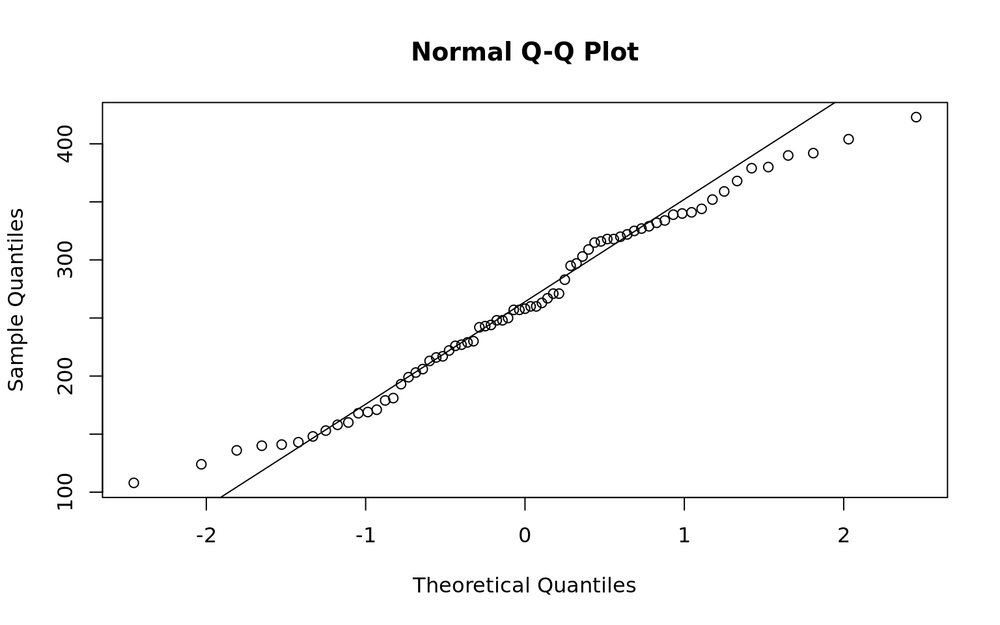

## Hypothesis Testing {-}
  * Shapiro Wilks
  * One Sample T-Test
  * Calculating Power
  * Hypothesis Testing
  * Sample Size Determination


```r
## Data sample on chick weights
data(chickwts)
head(chickwts)
```

```
  weight      feed
1    179 horsebean
2    160 horsebean
3    136 horsebean
4    227 horsebean
5    217 horsebean
6    168 horsebean
```

```r
## Normal reference plot for height
qqnorm(chickwts$weight)
qqline(chickwts$weight)
```



```r
## Are the data from a normal distribution?
shapiro.test(chickwts$weight)
```

```

	Shapiro-Wilk normality test

data:  chickwts$weight
W = 0.97674, p-value = 0.2101
```

```r
mean(chickwts$weight)
```

```
[1] 261.3099
```

How does the sample mean compare to a hypothesis test that the true mean is < 260? What is the power of the test?

$$H_0: \mu \ge 260, H_a: \mu \lt 260$$

|  Population   | Fail to Reject | Reject $H_0$ |
|:-------------:|:--------------:|:------------:|
| $H_0$ is True |    Correct     | Type I Error |
| $H_a$ is True | Type II Error  |   Correct    |


```r
## What is the probability of a Type I error if we say the true mean is less than 250?
t.test(chickwts$weight, mu = 250, alternative = "less")
```

```

	One Sample t-test

data:  chickwts$weight
t = 1.2206, df = 70, p-value = 0.8868
alternative hypothesis: true mean is less than 250
95 percent confidence interval:
     -Inf 276.7549
sample estimates:
mean of x 
 261.3099 
```

```r
## Verify the t statistic and p-value
(ts = (mean(chickwts$weight) - 250) / (sd(chickwts$weight) / sqrt(length(chickwts$weight))))
```

```
[1] 1.220623
```

```r
pt(ts, df = 70)
```

```
[1] 0.8868377
```

```r
## What is the probability of a Type I error if we say the true mean is > 245?
t.test(chickwts$weight, mu = 245, alternative = "greater")
```

```

	One Sample t-test

data:  chickwts$weight
t = 1.7603, df = 70, p-value = 0.04137
alternative hypothesis: true mean is greater than 245
95 percent confidence interval:
 245.8648      Inf
sample estimates:
mean of x 
 261.3099 
```

```r
## Verify the t statistic and p-value
(ts = (mean(chickwts$weight) - 245) / (sd(chickwts$weight) / sqrt(length(chickwts$weight))))
```

```
[1] 1.760251
```

```r
1 - pt(ts, df = 70)
```

```
[1] 0.04136678
```

```r
## We have rejected the null hypothesis and said under an alpha of .05 there is enough evidence
## to suppor that the true mean of Chick Weights is > 245

## What is the power of our test?
power.t.test(n = length(chickwts$weight),
             delta = abs(mean(chickwts$weight) - 245),
             sd = sd(chickwts$weight),
             sig.level = .05,
             type = "one.sample",
             alternative = "one.sided", strict = TRUE)
```

```

     One-sample t test power calculation 

              n = 71
          delta = 16.30986
             sd = 78.0737
      sig.level = 0.05
          power = 0.5391727
    alternative = one.sided
```

```r
## What sample size would we need to have a power of .8?
power.t.test(delta = abs(mean(chickwts$weight) - 245),
             sd = sd(chickwts$weight),
             sig.level = .05,
             power = .8,
             type = "one.sample",
             alternative = "one.sided", strict = TRUE)
```

```

     One-sample t test power calculation 

              n = 143.0323
          delta = 16.30986
             sd = 78.0737
      sig.level = 0.05
          power = 0.8
    alternative = one.sided
```

```r
## Verify manually
(sd(chickwts$weight)^2 * (qnorm(p = .95) + qnorm(p = .8))^2) / abs(mean(chickwts$weight) - 245)^2
```

```
[1] 141.6698
```
