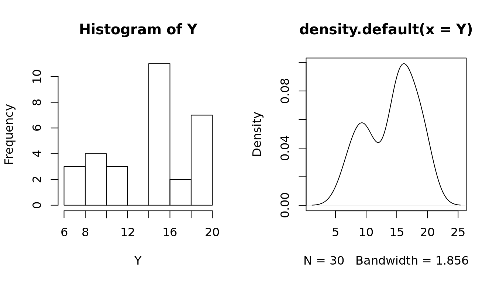
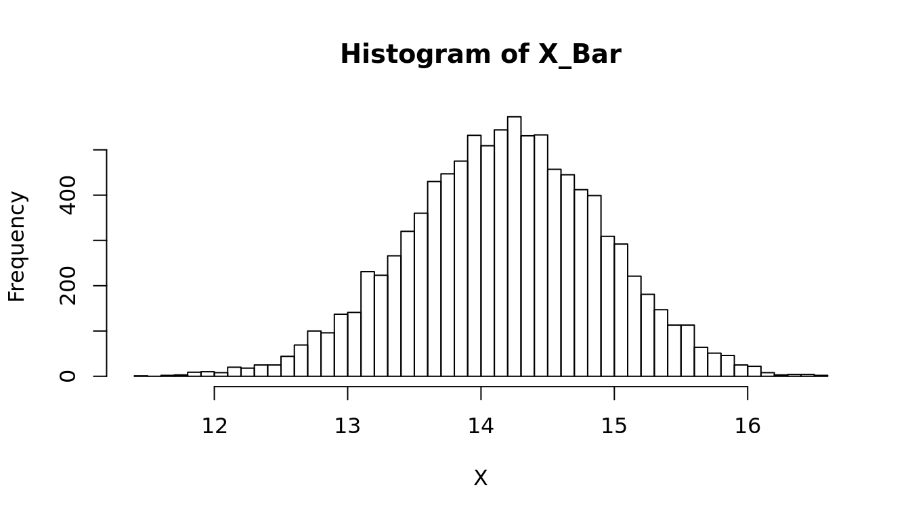

## Parameter Estimation {-}
  * Bootstrap Sampling


```r
## Create a mixed Distribution
set.seed(10)
y1 = rnorm(10, 10, 2); y2 = rnorm(10, 15, 1); y3 = rnorm(10, 20, 2)
Y = c(y1, y2, y3)

par(mfrow = c(1, 2))
hist(Y)
plot(density(Y))
```



```r
## Is Y part of a normal distribution?
shapiro.test(Y)
```

```

	Shapiro-Wilk normality test

data:  Y
W = 0.90712, p-value = 0.0126
```

```r
## Bootstrap simulation to estimate the mean
X = c()

## Draw 10k random samples from Y and calculate the mean
for (i in 1:10000) {
  x = sample(Y, length(Y), replace = TRUE)
  mu.x = mean(x)
  X = c(X, mu.x)
}

par(mfrow = c(1,1))
## Draw a histogram of the bootstrap samples for the sample means
hist(X, breaks = 50, main = "Histogram of X_Bar")
```



```r
## What is a 95% confidence interval for mu?
sort(X)[c(250, 9750)]
```

```
[1] 12.72430 15.58161
```
