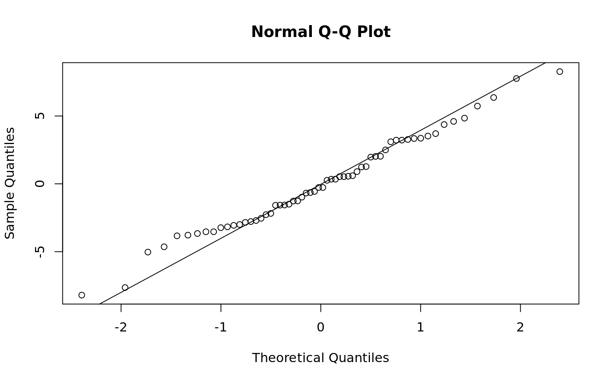
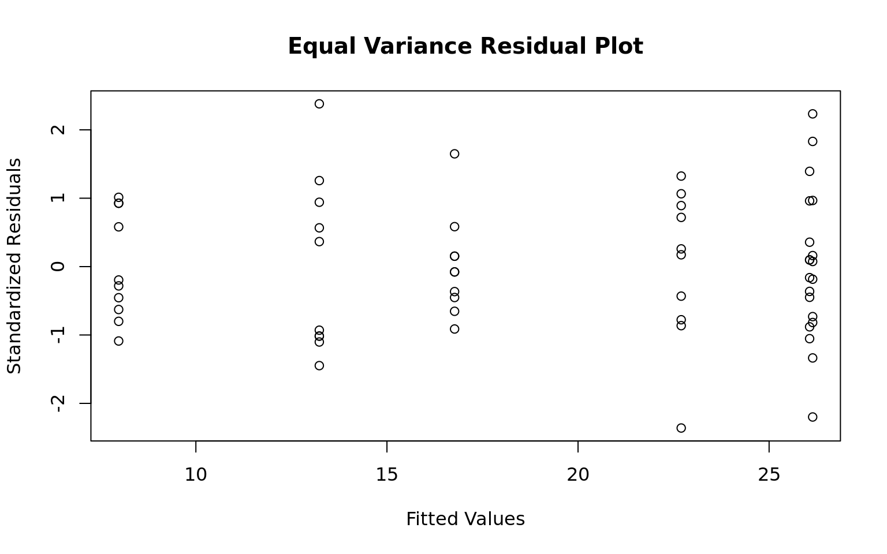
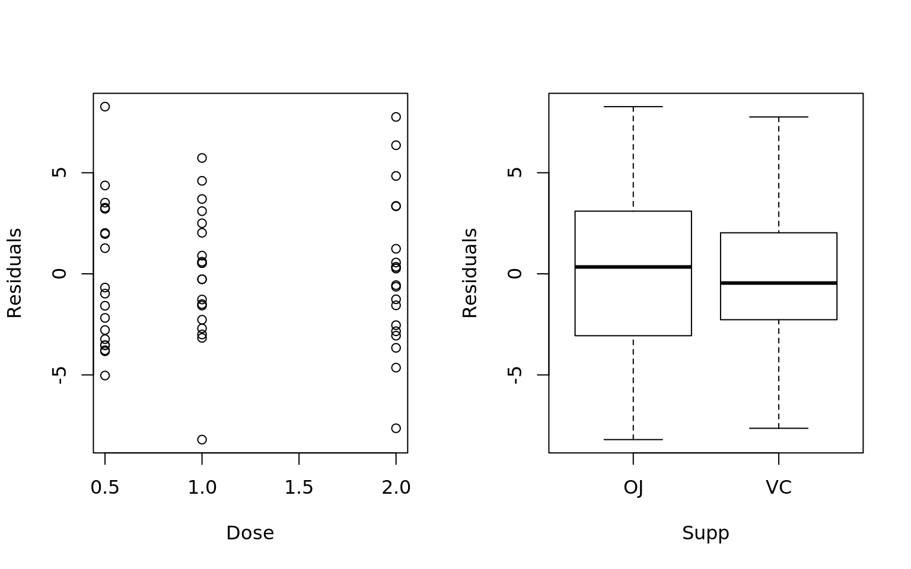
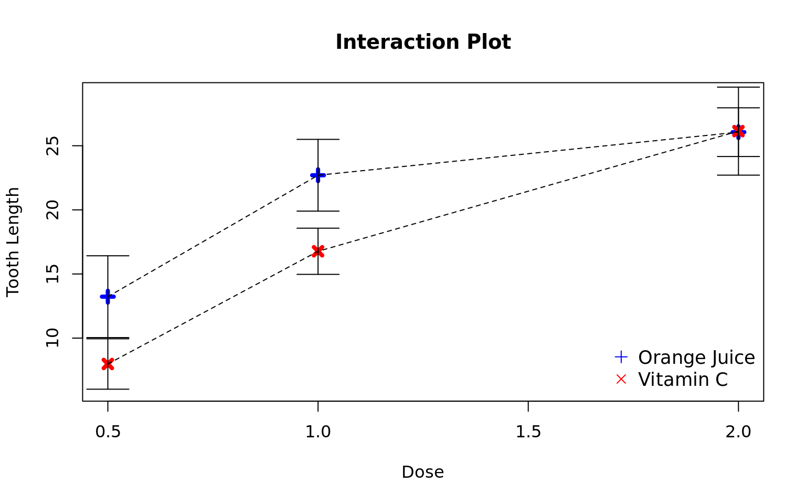

## Experimental Design {-}

### Completely Random Design {-}

The response is the length of odontoblasts (cells responsible for tooth growth) in 60 guinea pigs. Each animal received one of three dose levels of vitamin C (0.5, 1, and 2 mg/day) by one of two delivery methods, orange juice or ascorbic acid (a form of vitamin C and coded as VC).

- Treatment Structure: 2 x 3 Factorial Treatment, both Fixed

- Model: $y_{ijk} = \mu + \alpha_i + \beta_j + \alpha \beta_{ij} + e_{ijk}$
- Treatments: $\alpha_i = \text{supp, } \beta_j = \text{dose}$
- Fixed Effects: $\alpha_1 = \beta_1 = \alpha \beta_{1j} = \alpha \beta_{i1} = 0$
- Random Effects: $e_{ijk} = N(0, \sigma^2_e)$


```r
library(lsmeans)
library(reshape2)
library(car)
library(plyr)

data("ToothGrowth")

## Data is numeric, but we need to force it to be a factor for the model
ToothGrowth$dose.factor = as.factor(ToothGrowth$dose)
summary(ToothGrowth)
```

```
      len        supp         dose       dose.factor
 Min.   : 4.20   OJ:30   Min.   :0.500   0.5:20     
 1st Qu.:13.07   VC:30   1st Qu.:0.500   1  :20     
 Median :19.25           Median :1.000   2  :20     
 Mean   :18.81           Mean   :1.167              
 3rd Qu.:25.27           3rd Qu.:2.000              
 Max.   :33.90           Max.   :2.000              
```

```r
## Even observations per treatment group
table(ToothGrowth$supp, ToothGrowth$dose)
```

```
    
     0.5  1  2
  OJ  10 10 10
  VC  10 10 10
```

```r
## ANOVA model
mdl = lm(len ~ supp * dose.factor, data = ToothGrowth)
anova(mdl)
```

```
Analysis of Variance Table

Response: len
                 Df  Sum Sq Mean Sq F value    Pr(>F)    
supp              1  205.35  205.35  15.572 0.0002312 ***
dose.factor       2 2426.43 1213.22  92.000 < 2.2e-16 ***
supp:dose.factor  2  108.32   54.16   4.107 0.0218603 *  
Residuals        54  712.11   13.19                      
---
Signif. codes:  0 '***' 0.001 '**' 0.01 '*' 0.05 '.' 0.1 ' ' 1
```

```r
## Least Squares Means
lsmeans(mdl, specs = c("supp", "dose.factor"))
```

```
 supp dose.factor lsmean       SE df  lower.CL upper.CL
 OJ   0.5          13.23 1.148353 54 10.927691 15.53231
 VC   0.5           7.98 1.148353 54  5.677691 10.28231
 OJ   1            22.70 1.148353 54 20.397691 25.00231
 VC   1            16.77 1.148353 54 14.467691 19.07231
 OJ   2            26.06 1.148353 54 23.757691 28.36231
 VC   2            26.14 1.148353 54 23.837691 28.44231

Confidence level used: 0.95 
```

```r
## Differences in Means
TukeyHSD(aov(mdl))
```

```
  Tukey multiple comparisons of means
    95% family-wise confidence level

Fit: aov(formula = mdl)

$supp
      diff       lwr       upr     p adj
VC-OJ -3.7 -5.579828 -1.820172 0.0002312

$dose.factor
        diff       lwr       upr   p adj
1-0.5  9.130  6.362488 11.897512 0.0e+00
2-0.5 15.495 12.727488 18.262512 0.0e+00
2-1    6.365  3.597488  9.132512 2.7e-06

$`supp:dose.factor`
               diff        lwr        upr     p adj
VC:0.5-OJ:0.5 -5.25 -10.048124 -0.4518762 0.0242521
OJ:1-OJ:0.5    9.47   4.671876 14.2681238 0.0000046
VC:1-OJ:0.5    3.54  -1.258124  8.3381238 0.2640208
OJ:2-OJ:0.5   12.83   8.031876 17.6281238 0.0000000
VC:2-OJ:0.5   12.91   8.111876 17.7081238 0.0000000
OJ:1-VC:0.5   14.72   9.921876 19.5181238 0.0000000
VC:1-VC:0.5    8.79   3.991876 13.5881238 0.0000210
OJ:2-VC:0.5   18.08  13.281876 22.8781238 0.0000000
VC:2-VC:0.5   18.16  13.361876 22.9581238 0.0000000
VC:1-OJ:1     -5.93 -10.728124 -1.1318762 0.0073930
OJ:2-OJ:1      3.36  -1.438124  8.1581238 0.3187361
VC:2-OJ:1      3.44  -1.358124  8.2381238 0.2936430
OJ:2-VC:1      9.29   4.491876 14.0881238 0.0000069
VC:2-VC:1      9.37   4.571876 14.1681238 0.0000058
VC:2-OJ:2      0.08  -4.718124  4.8781238 1.0000000
```

Are the necessary conditions for hypothesis testing present?

- Normality: Residuals appear normally distributed per the residual normal reference plot and shapiro-wilks test
- Equal Variance: Brown-Forsythe-Levene test and residual plot supports equal variance
- Independence: No correlation in the residuals per the Durbin Watson test and plots of variables against residuals

Conditions for hypothesis testing appears to be satisfied


```r
## Normality of Residuals
shapiro.test(mdl$residuals); qqnorm(mdl$residuals); qqline(mdl$residuals)
```

```

	Shapiro-Wilk normality test

data:  mdl$residuals
W = 0.98499, p-value = 0.6694
```



```r
## Equal Variance of Residuals
leveneTest(mdl)
```

```
Levene's Test for Homogeneity of Variance (center = median)
      Df F value Pr(>F)
group  5  1.7086 0.1484
      54               
```

```r
plot(x = mdl$fitted.values, y = (mdl$residual - mean(mdl$residuals))/sd(mdl$residuals),
     xlab = "Fitted Values", ylab = "Standardized Residuals",
     main = "Equal Variance Residual Plot")
```



```r
## Independence of Residuals
par(mfrow = c(1, 2))
plot(ToothGrowth$dose, mdl$residuals, xlab = "Dose", ylab = "Residuals")
plot(ToothGrowth$supp, mdl$residuals, xlab = "Supp", ylab = "Residuals")
```



```r
## Test for correlation in the residuals
durbinWatsonTest(mdl)
```

```
 lag Autocorrelation D-W Statistic p-value
   1     -0.02932541      2.025437    0.55
 Alternative hypothesis: rho != 0
```

- Group doses so that each dose is not statistically different than any other dose in the group:
    + The interaction between dose and supp are significant so we need to assess the differences in dose per each level of supp.
    + OJ: {.5}, {1, 2}
    + VC: {.5}, {1}, {2}
- Group supps so that each supp is not statistically different than any other supp in the group:
    + The interaction is significant so we need to assess the supps at each level of dose
    + .5: {OJ}, {VC}
    + 1: {OJ}, {VC}
    + 2: {OJ, VC}





### Random Complete Block Design {-}

An experiment was conducted to compare four different pre-planting treatments for soybeen seeds. A fifth treatment, consisting of not treating the seeds was used as a control. The experimental area consisted of four fields. There are notable differences in the fields. Each field was divided into five plots and one of the treatments was randomly assigned to a plot within each field.

- Treatment Structure: 1 Single Treatment with 5 levels
- Response: The number of plants that failed to emerge out of 100 seeds planted per plot.

- Model: $y_{ij} = \mu + \alpha_i + \beta_j + e_{ij}$
- Treatments: $\alpha_i = \text{Seed, } \beta_j = \text{Field, } \alpha_5 = \text{Control}$
- Fixed Effects: $\alpha_5 = \beta_1 = 0$
- Random Effects: $e_{ij} = N(0, \sigma^2_e)$

---


---------------------------------------------------
 Treatment   Field.1   Field.2   Field.3   Field.4 
----------- --------- --------- --------- ---------
  Avasan        2         5         7        11    

  Spergon       4        10         9         8    

 Semaesan       3         6         9        10    

  Fermate       9         3         5         5    

  Control       8        11        12        13    
---------------------------------------------------

Table: Soy Bean Data


```r
## Make the control treatment the default level
soy$Treatment = relevel(soy$Treatment, ref = "Control")

## We only have one rep per treatment so there are not enough DF to measure the interaction
mdl = lm(Count ~ Field + Treatment, data = soy)
anova(mdl)
```

```
Analysis of Variance Table

Response: Count
          Df Sum Sq Mean Sq F value  Pr(>F)  
Field      3   49.8 16.6000  2.5971 0.10070  
Treatment  4   72.5 18.1250  2.8357 0.07227 .
Residuals 12   76.7  6.3917                  
---
Signif. codes:  0 '***' 0.001 '**' 0.01 '*' 0.05 '.' 0.1 ' ' 1
```

---

#### Comparison of means vs control

Since we have a control variable we want to know if any of the treatment means are significantly lower than the control mean.


```r
library(multcomp)

Dunnet = glht(mdl, linfct = mcp(Treatment = "Dunnet"), alternative = "less")
summary(Dunnet)
```

```

	 Simultaneous Tests for General Linear Hypotheses

Multiple Comparisons of Means: Dunnett Contrasts


Fit: lm(formula = Count ~ Field + Treatment, data = soy)

Linear Hypotheses:
                        Estimate Std. Error t value Pr(<t)  
Avasan - Control >= 0     -4.750      1.788  -2.657 0.0324 *
Fermate - Control >= 0    -5.500      1.788  -3.077 0.0155 *
Semaesan - Control >= 0   -4.000      1.788  -2.238 0.0668 .
Spergon - Control >= 0    -3.250      1.788  -1.818 0.1311  
---
Signif. codes:  0 '***' 0.001 '**' 0.01 '*' 0.05 '.' 0.1 ' ' 1
(Adjusted p values reported -- single-step method)
```

We have significant evidence that only Avasan and Fermate are significantly lower than the control. Are they significantly different from each other?


```r
TukeyHSD(aov(mdl))
```

```
  Tukey multiple comparisons of means
    95% family-wise confidence level

Fit: aov(formula = mdl)

$Field
                diff        lwr      upr     p adj
Field.2-Field.1  1.8 -2.9471482 6.547148 0.6814523
Field.3-Field.1  3.2 -1.5471482 7.947148 0.2406905
Field.4-Field.1  4.2 -0.5471482 8.947148 0.0895218
Field.3-Field.2  1.4 -3.3471482 6.147148 0.8173180
Field.4-Field.2  2.4 -2.3471482 7.147148 0.4666374
Field.4-Field.3  1.0 -3.7471482 5.747148 0.9219188

$Treatment
                  diff        lwr       upr     p adj
Avasan-Control   -4.75 -10.448139 0.9481388 0.1206718
Fermate-Control  -5.50 -11.198139 0.1981388 0.0603205
Semaesan-Control -4.00  -9.698139 1.6981388 0.2305921
Spergon-Control  -3.25  -8.948139 2.4481388 0.4074833
Fermate-Avasan   -0.75  -6.448139 4.9481388 0.9926478
Semaesan-Avasan   0.75  -4.948139 6.4481388 0.9926478
Spergon-Avasan    1.50  -4.198139 7.1981388 0.9131542
Semaesan-Fermate  1.50  -4.198139 7.1981388 0.9131542
Spergon-Fermate   2.25  -3.448139 7.9481388 0.7194742
Spergon-Semaesan  0.75  -4.948139 6.4481388 0.9926478
```

There is not significant evidence between the difference in means between any of the treatments.
