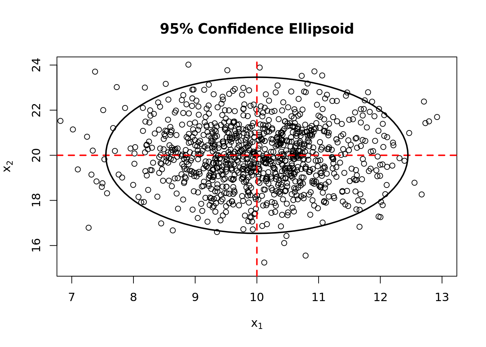

## Eigen Values and Statistical Distance {-}


```r
## Eigen values and vectors are used to describe a positie definate covariance matrix.
(Cov = matrix(c(1, 0, 0, 2), nrow = 2))
```

```
     [,1] [,2]
[1,]    1    0
[2,]    0    2
```

```r
eig = eigen(Cov)

## eigen values
(lambda = eig$values)
```

```
[1] 2 1
```

```r
## eigen vectors
(ee = eig$vectors)
```

```
     [,1] [,2]
[1,]    0   -1
[2,]    1    0
```

```r
## Spectural decompsotion allows you to reconstruct a matrix using only the eigen
## values and vectors
lambda[1] * ee[,1] %*% t(ee[,1]) + lambda[2] * ee[,2] %*% t(ee[,2])
```

```
     [,1] [,2]
[1,]    1    0
[2,]    0    2
```

```r
## Straight line distance (Euclidean) vs Statistical Distance
## Straight line distance to the origin using point(1, 1)
sqrt((1 - 0)^2 + (1 - 0)^2)
```

```
[1] 1.414214
```

```r
# Statistical Distance to the origin
sqrt((1 -  0)^2/1 + (1 - 0)^2/5)
```

```
[1] 1.095445
```

```r
## Generating Multivariate Normal Data
library(mvtnorm)

## set up parameters, 2 means use the covariance matrix from earlier
mu = c(10, 20)

## generate a large dataset
set.seed(1000)
X = rmvnorm(1000, mu, Cov)

## Correlation of X, should be close to 0
cor(X)
```

```
           [,1]       [,2]
[1,]  1.0000000 -0.0217756
[2,] -0.0217756  1.0000000
```

```r
## Calculate the distance between each point and the means
distance = c()
for (i in 1:nrow(X)) {
  x = t(X[i, ] - colMeans(X)) %*% solve(cov(X)) %*% (X[i, ] - colMeans(X))
  distance = c(distance, x)
}
## distances
head(distance)
```

```
[1] 1.7095871 0.4531800 0.7819858 0.7832673 1.9309843 1.3017149
```

```r
## What is the distance that captures 95% of all points generated from the distribution?
(critical.value = qchisq(.95, 2))
```

```
[1] 5.991465
```

```r
## What is the proportion of points that fall within this distance?
## As n increases the proportion should converge on 5%
length(which((distance - critical.value) > 0))/length(distance)
```

```
[1] 0.051
```

```r
## plot a 95% confidence ellipse for the generated data
library(plotrix)
plot(x = c(7,13), y = c(15,24), type = "n",
  xlab = expression(x[1]), ylab = expression(x[2]),
  main = "95% Confidence Ellipsoid")
points(X[, 1], X[, 2])
abline(h = 20, v = 10, lty = 2, lwd = 2, col = "red")
draw.ellipse(10, 20,
  sqrt(critical.value * lambda[1]),
  sqrt(critical.value * lambda[2]),
  ## convert radians to degrees
  angle = acos(abs(ee[1,1])) * 57.2957795,
  border = 1, lwd = 2)
```


