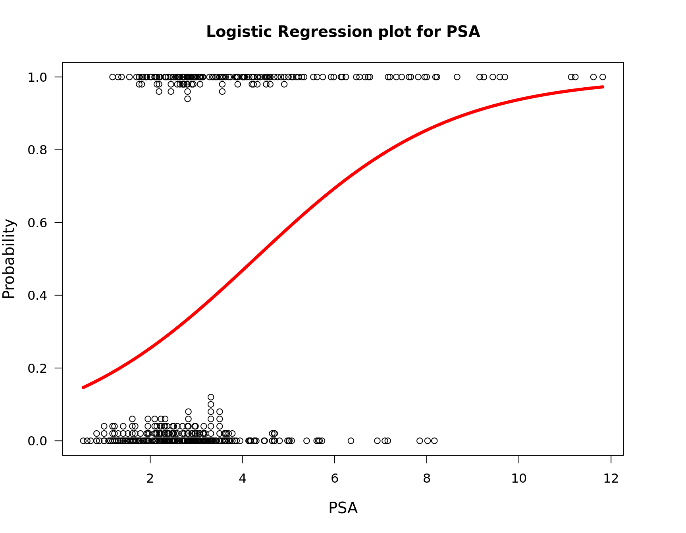
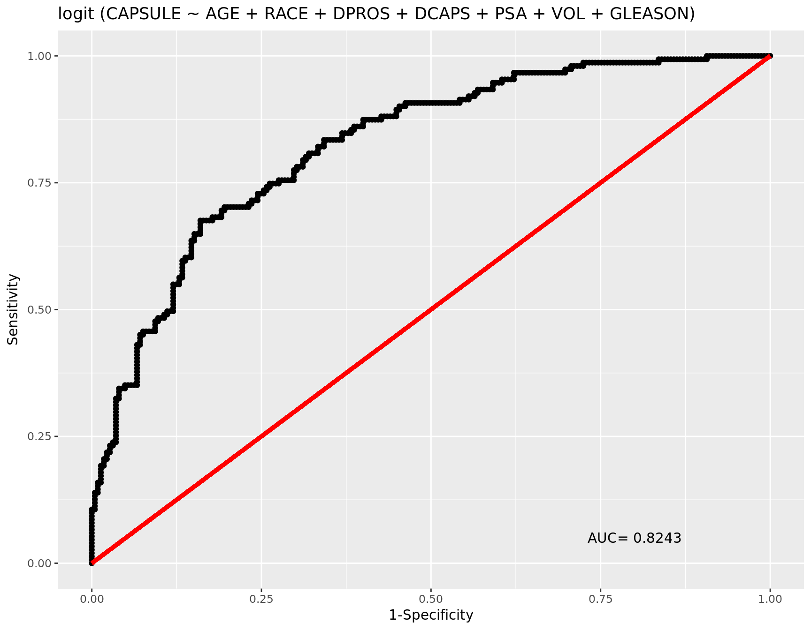

## Logistic Regression {-}


```r
library(popbio)
library(Deducer)

dta = read.csv("data/pros.csv")

head(dta)
```

```
  ID CAPSULE AGE RACE DPROS DCAPS  PSA  VOL GLEASON
1  1       0  65    1     2     1  1.4  0.0       6
2  2       0  72    1     3     2  6.7  0.0       7
3  3       0  70    1     1     2  4.9  0.0       6
4  4       0  76    2     2     1 51.2 20.0       7
5  5       0  69    1     1     1 12.3 55.9       6
6  6       1  71    1     3     2  3.3  0.0       8
```

```r
mdl = glm(CAPSULE ~ AGE + RACE + DPROS + DCAPS + PSA + VOL + GLEASON,
          family = binomial(), data = dta)

summary(mdl)
```

```

Call:
glm(formula = CAPSULE ~ AGE + RACE + DPROS + DCAPS + PSA + VOL + 
    GLEASON, family = binomial(), data = dta)

Deviance Residuals: 
    Min       1Q   Median       3Q      Max  
-2.4058  -0.7772  -0.4416   0.9019   2.3771  

Coefficients:
             Estimate Std. Error z value Pr(>|z|)    
(Intercept) -6.915650   1.728754  -4.000 6.32e-05 ***
AGE         -0.015825   0.019517  -0.811  0.41745    
RACE        -0.695258   0.476106  -1.460  0.14421    
DPROS        0.551597   0.136545   4.040 5.35e-05 ***
DCAPS        0.479916   0.463728   1.035  0.30071    
PSA          0.027196   0.009922   2.741  0.00613 ** 
VOL         -0.010840   0.007753  -1.398  0.16204    
GLEASON      0.972442   0.167259   5.814 6.10e-09 ***
---
Signif. codes:  0 '***' 0.001 '**' 0.01 '*' 0.05 '.' 0.1 ' ' 1

(Dispersion parameter for binomial family taken to be 1)

    Null deviance: 506.59  on 375  degrees of freedom
Residual deviance: 377.31  on 368  degrees of freedom
  (4 observations deleted due to missingness)
AIC: 393.31

Number of Fisher Scoring iterations: 5
```

```r
logi.hist.plot(sqrt(dta$PSA), dta$CAPSULE, logi.mod = 1, boxp = FALSE, notch = FALSE,
               main = "Logistic Regression plot for PSA",
               xlab = "PSA")
```



```r
rocplot(mdl)
```


