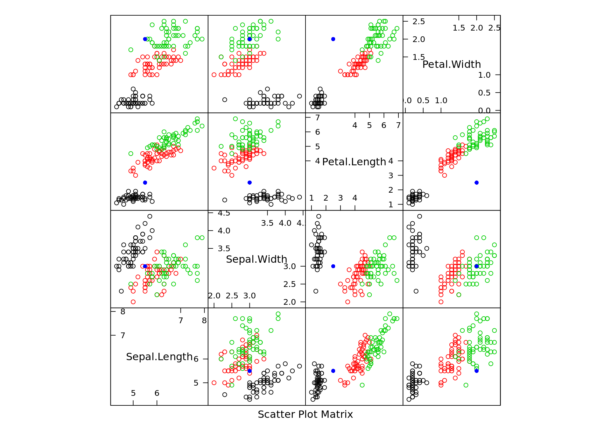

## Multinomial Logistic Regression {-}


```r
library(nnet)
library(devtools)
library(lattice)

## Using the iris dataset
summary(iris)
```

```
  Sepal.Length    Sepal.Width     Petal.Length    Petal.Width   
 Min.   :4.300   Min.   :2.000   Min.   :1.000   Min.   :0.100  
 1st Qu.:5.100   1st Qu.:2.800   1st Qu.:1.600   1st Qu.:0.300  
 Median :5.800   Median :3.000   Median :4.350   Median :1.300  
 Mean   :5.843   Mean   :3.057   Mean   :3.758   Mean   :1.199  
 3rd Qu.:6.400   3rd Qu.:3.300   3rd Qu.:5.100   3rd Qu.:1.800  
 Max.   :7.900   Max.   :4.400   Max.   :6.900   Max.   :2.500  
       Species  
 setosa    :50  
 versicolor:50  
 virginica :50  
                
                
                
```

```r
## Build a multinomial logistic model from the nnet package
mdl = multinom(Species ~ ., data = iris)
```

```
# weights:  18 (10 variable)
initial  value 164.791843 
iter  10 value 16.177348
iter  20 value 7.111438
iter  30 value 6.182999
iter  40 value 5.984028
iter  50 value 5.961278
iter  60 value 5.954900
iter  70 value 5.951851
iter  80 value 5.950343
iter  90 value 5.949904
iter 100 value 5.949867
final  value 5.949867 
stopped after 100 iterations
```

```r
summary(mdl)
```

```
Call:
multinom(formula = Species ~ ., data = iris)

Coefficients:
           (Intercept) Sepal.Length Sepal.Width Petal.Length Petal.Width
versicolor    18.69037    -5.458424   -8.707401     14.24477   -3.097684
virginica    -23.83628    -7.923634  -15.370769     23.65978   15.135301

Std. Errors:
           (Intercept) Sepal.Length Sepal.Width Petal.Length Petal.Width
versicolor    34.97116     89.89215    157.0415     60.19170    45.48852
virginica     35.76649     89.91153    157.1196     60.46753    45.93406

Residual Deviance: 11.89973 
AIC: 31.89973 
```

```r
## Prediction based on Sepal and Petal values
sample = data.frame(Sepal.Length = 5.5,
                    Sepal.Width = 3,
                    Petal.Length = 2.5,
                    Petal.Width = 2)

round(predict(mdl, sample, type = "probs"))
```

```
    setosa versicolor  virginica 
         1          0          0 
```

```r
## Scatterplot Matrix
splom(iris[, 1:4], col = 1:3,
      panel = function(x, y, i, j, groups, ...) {
        panel.points(x, y, col = iris$Species)
        panel.points(sample[1, j], sample[1, i], col = 'blue', pch = 16)
      }, auto.key = TRUE)
```


