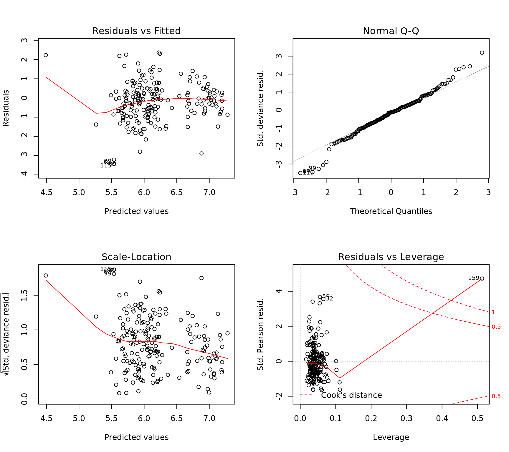
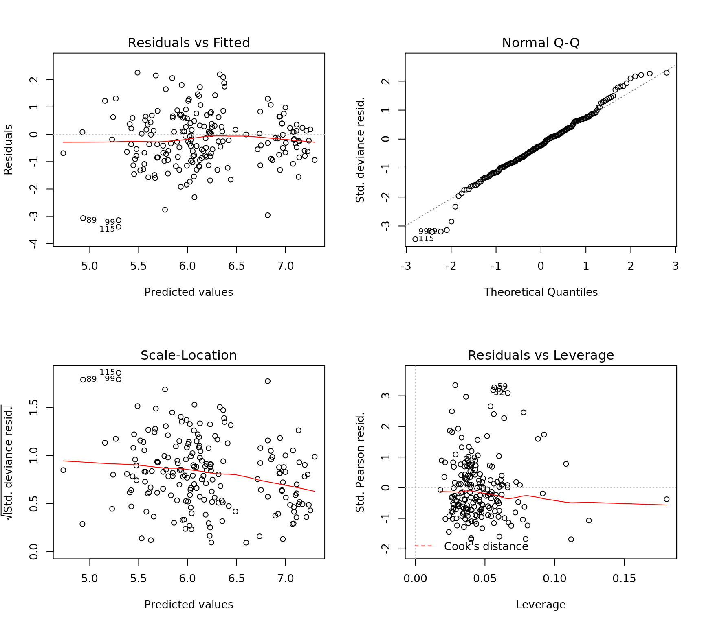

## Poisson Regression {-}


```r
library(MASS)

dta = read.csv("data/pharynx.csv")

head(dta)
```

```
  CASE INST SEX TX GRADE AGE COND SITE T_STAGE N_STAGE ENTRY_DT STATUS
1    1    2   2  1     1  51    1    2       3       1     2468      1
2    2    2   1  2     1  65    1    4       2       3     2968      1
3    3    2   1  1     2  64    2    1       3       3     3368      1
4    4    2   1  1     1  73    1    1       4       0     5768      1
5    5    5   1  2     2  64    1    1       4       3     9568      1
6    6    4   1  2     1  61    1    2       3       0    10668      0
  TIME
1  631
2  270
3  327
4  243
5  916
6 1823
```

```r
## Poisson Regression Model for Survival Time
mdl = glm(TIME ~ SEX + TX + AGE + COND + SITE + T_STAGE + N_STAGE + STATUS,
          family = poisson(), data = dta)

## Negative Binomial Model for Survival Time
mdl2 = glm.nb(TIME ~ SEX + TX + AGE + COND + SITE + T_STAGE + N_STAGE + STATUS,
              maxit = 100, data = dta)

## Dispersion paramater > 0 so poisson is not appropriate, negative binomial is a better model
par(mfrow = c(2,2))
plot(mdl2)
```



```r
## Remove the outlier observation and retrain
dta = dta[-159, ]

mdl.nb = glm.nb(TIME ~ SEX + TX + AGE + COND + SITE + T_STAGE + N_STAGE + STATUS,
              maxit = 100, data = dta)

summary(mdl.nb)
```

```

Call:
glm.nb(formula = TIME ~ SEX + TX + AGE + COND + SITE + T_STAGE + 
    N_STAGE + STATUS, data = dta, maxit = 100, init.theta = 3.121080189, 
    link = log)

Deviance Residuals: 
    Min       1Q   Median       3Q      Max  
-3.3855  -0.8138  -0.2142   0.4034   2.2540  

Coefficients:
             Estimate Std. Error z value Pr(>|z|)    
(Intercept)  7.646448   0.369792  20.678   <2e-16 ***
SEX          0.142239   0.098324   1.447   0.1480    
TX          -0.140805   0.082706  -1.702   0.0887 .  
AGE          0.006148   0.003802   1.617   0.1059    
COND        -0.510610   0.076821  -6.647    3e-11 ***
SITE        -0.006501   0.034988  -0.186   0.8526    
T_STAGE     -0.119522   0.053337  -2.241   0.0250 *  
N_STAGE     -0.058860   0.036701  -1.604   0.1088    
STATUS      -0.886395   0.094450  -9.385   <2e-16 ***
---
Signif. codes:  0 '***' 0.001 '**' 0.01 '*' 0.05 '.' 0.1 ' ' 1

(Dispersion parameter for Negative Binomial(3.1211) family taken to be 1)

    Null deviance: 385.38  on 193  degrees of freedom
Residual deviance: 205.16  on 185  degrees of freedom
AIC: 2704.2

Number of Fisher Scoring iterations: 1

              Theta:  3.121 
          Std. Err.:  0.306 

 2 x log-likelihood:  -2684.213 
```

```r
plot(mdl.nb)
```


