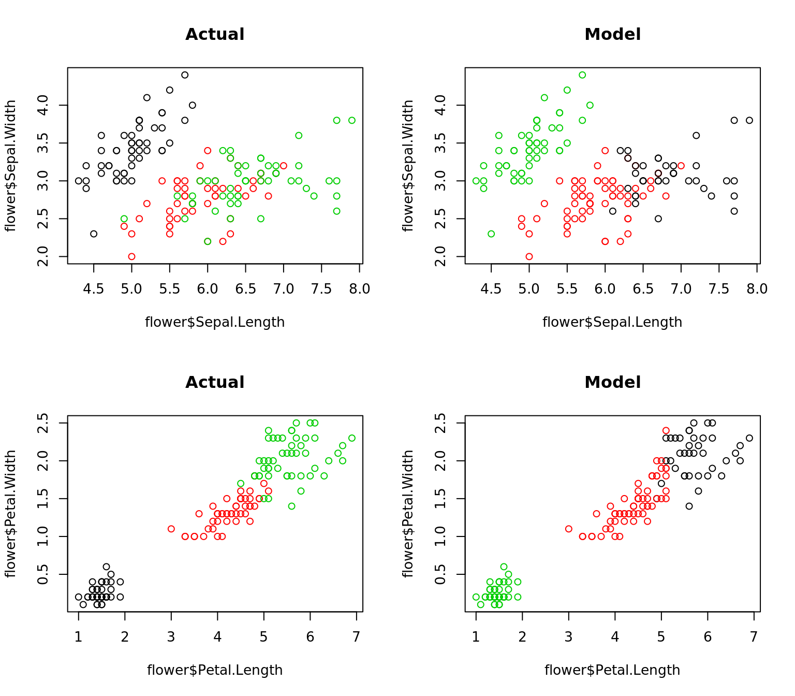
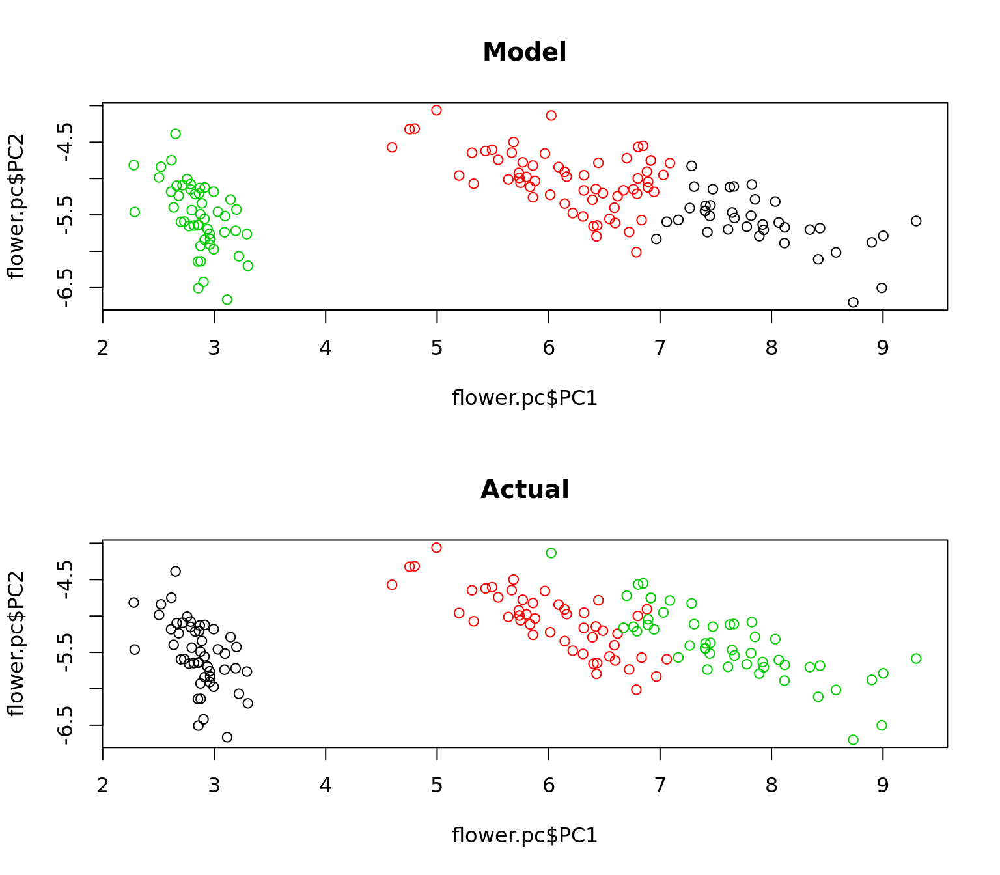

# Clustering Methods {-}

## Kmeans Clustering {-}


```r
## The famous iris dataset
data(iris)
flower = iris

head(flower)
```

```
  Sepal.Length Sepal.Width Petal.Length Petal.Width Species
1          5.1         3.5          1.4         0.2  setosa
2          4.9         3.0          1.4         0.2  setosa
3          4.7         3.2          1.3         0.2  setosa
4          4.6         3.1          1.5         0.2  setosa
5          5.0         3.6          1.4         0.2  setosa
6          5.4         3.9          1.7         0.4  setosa
```

```r
summary(flower)
```

```
  Sepal.Length    Sepal.Width     Petal.Length    Petal.Width   
 Min.   :4.300   Min.   :2.000   Min.   :1.000   Min.   :0.100  
 1st Qu.:5.100   1st Qu.:2.800   1st Qu.:1.600   1st Qu.:0.300  
 Median :5.800   Median :3.000   Median :4.350   Median :1.300  
 Mean   :5.843   Mean   :3.057   Mean   :3.758   Mean   :1.199  
 3rd Qu.:6.400   3rd Qu.:3.300   3rd Qu.:5.100   3rd Qu.:1.800  
 Max.   :7.900   Max.   :4.400   Max.   :6.900   Max.   :2.500  
       Species  
 setosa    :50  
 versicolor:50  
 virginica :50  
                
                
                
```

```r
## Kmeans requires you to predetermine the number of clusters
mdl = kmeans(flower[, 1:4], centers = 3)
flower$cluster = mdl$cluster

## plot kmeans for a few of the variable combinations
par(mfrow = c(2, 2))
plot(x = flower$Sepal.Length, y = flower$Sepal.Width, col = factor(flower$Species), main = "Actual")
plot(x = flower$Sepal.Length, y = flower$Sepal.Width, col = factor(flower$cluster), main = "Model")
plot(x = flower$Petal.Length, y = flower$Petal.Width, col = factor(flower$Species), main = "Actual")
plot(x = flower$Petal.Length, y = flower$Petal.Width, col = factor(flower$cluster), main = "Model")
```



```r
## Try using principal components to draw one picture that catures all of the variance
pc = prcomp(flower[, 1:4], cor = TRUE)
summary(pc)
```

```
Importance of components:
                          PC1     PC2    PC3     PC4
Standard deviation     2.0563 0.49262 0.2797 0.15439
Proportion of Variance 0.9246 0.05307 0.0171 0.00521
Cumulative Proportion  0.9246 0.97769 0.9948 1.00000
```

```r
## The first 2 principal components explains 97% of all variation
flower.pc = as.data.frame(as.matrix(flower[, 1:4]) %*% pc$rotation)
flower.pc$cluster = flower$cluster
flower.pc$species = flower$Species

## How well did the model do?
par(mfrow = c(2, 1))
plot(flower.pc$PC1, flower.pc$PC2, col = factor(flower.pc$cluster), main = "Model")
plot(flower.pc$PC1, flower.pc$PC2, col = factor(flower.pc$species), main = "Actual")
```


