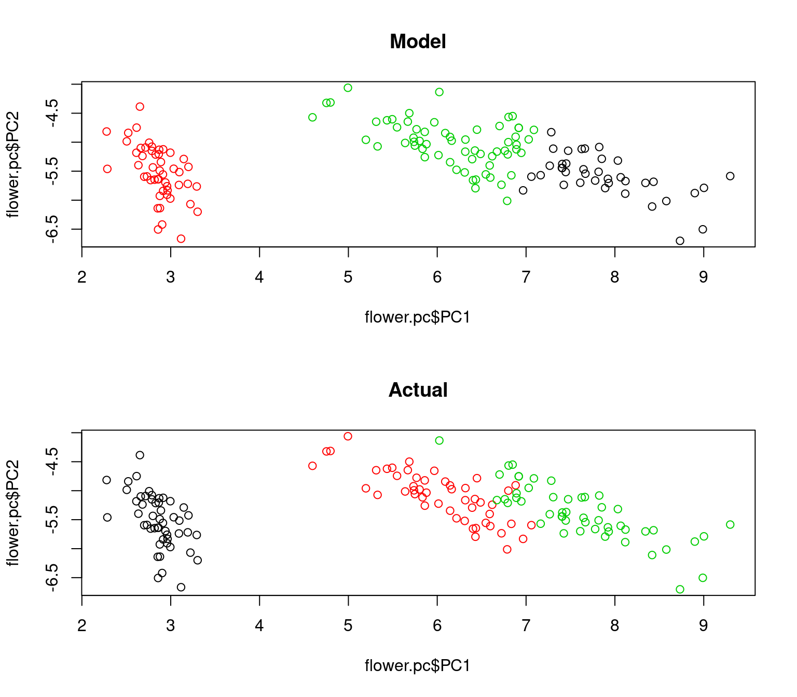

# Clustering Methods {-}


## Kmeans Clustering {-}


```r
## The famous iris dataset
data(iris)
flower = iris

head(flower)
```

```
  Sepal.Length Sepal.Width Petal.Length Petal.Width Species
1          5.1         3.5          1.4         0.2  setosa
2          4.9         3.0          1.4         0.2  setosa
3          4.7         3.2          1.3         0.2  setosa
4          4.6         3.1          1.5         0.2  setosa
5          5.0         3.6          1.4         0.2  setosa
6          5.4         3.9          1.7         0.4  setosa
```

```r
summary(flower)
```

```
  Sepal.Length    Sepal.Width     Petal.Length    Petal.Width   
 Min.   :4.300   Min.   :2.000   Min.   :1.000   Min.   :0.100  
 1st Qu.:5.100   1st Qu.:2.800   1st Qu.:1.600   1st Qu.:0.300  
 Median :5.800   Median :3.000   Median :4.350   Median :1.300  
 Mean   :5.843   Mean   :3.057   Mean   :3.758   Mean   :1.199  
 3rd Qu.:6.400   3rd Qu.:3.300   3rd Qu.:5.100   3rd Qu.:1.800  
 Max.   :7.900   Max.   :4.400   Max.   :6.900   Max.   :2.500  
       Species  
 setosa    :50  
 versicolor:50  
 virginica :50  
                
                
                
```

```r
## Kmeans requires you to predetermine the number of clusters
mdl = kmeans(flower[, 1:4], centers = 3)
flower$cluster = mdl$cluster

## plot kmeans for a few of the variable combinations
par(mfrow = c(2, 2))
plot(x = flower$Sepal.Length, y = flower$Sepal.Width, col = factor(flower$Species), main = "Actual")
plot(x = flower$Sepal.Length, y = flower$Sepal.Width, col = factor(flower$cluster), main = "Model")
plot(x = flower$Petal.Length, y = flower$Petal.Width, col = factor(flower$Species), main = "Actual")
plot(x = flower$Petal.Length, y = flower$Petal.Width, col = factor(flower$cluster), main = "Model")
```


```r
## Try using principal components to draw one picture that catures all of the variance
pc = prcomp(flower[, 1:4], cor = TRUE)
summary(pc)
```

```
Importance of components:
                          PC1     PC2    PC3     PC4
Standard deviation     2.0563 0.49262 0.2797 0.15439
Proportion of Variance 0.9246 0.05307 0.0171 0.00521
Cumulative Proportion  0.9246 0.97769 0.9948 1.00000
```

```r
## The first 2 principal components explains 97% of all variation
flower.pc = as.data.frame(as.matrix(flower[, 1:4]) %*% pc$rotation)
flower.pc$cluster = flower$cluster
flower.pc$species = flower$Species

## How well did the model do?
par(mfrow = c(2, 1))
plot(flower.pc$PC1, flower.pc$PC2, col = factor(flower.pc$cluster), main = "Model")
plot(flower.pc$PC1, flower.pc$PC2, col = factor(flower.pc$species), main = "Actual")
```




## Hierarchical Clustering {-}


```r
library(cluster)

## Hierarchical clustering using the mtcars dataset
##
## Data description from R:
## The data was extracted from the 1974 Motor Trend US magazine, and comprises
## fuel consumption and 10 aspects of automobile design and performance for
## 32 automobiles (1973-74 models).
##

## Since the attributes have different scales we need to standardize them
cars.dist = dist(scale(mtcars, center = TRUE, scale = TRUE))

## Clustering by rows (cars)
## Method Average, average distance between all points in a cluster
plot(hclust(cars.dist, method = "average"), xlab = "", ylab ="Distance")
```


```r
## Method Single, shortest distance between each cluster
plot(hclust(cars.dist, method = "single"), xlab = "", ylab ="Distance")
```


```r
## Method Complete, longest distance between each cluster
plot(hclust(cars.dist, method = "complete"), xlab = "", ylab ="Distance")
```


```r
## Method Ward, minimizes the loss of exmplained variance
plot(hclust(cars.dist, method = "ward.D"), xlab = "", ylab ="Distance")
```


```r
## Attribute Descriptions:
##
## mpg	 Miles/(US) gallon
## cyl	 Number of cylinders
## disp	 Displacement (cu.in.)
## hp	 Gross horsepower
## drat	 Rear axle ratio
## wt	 Weight (lb/1000)
## qsec	 1/4 mile time
## vs	 V/S
## am	 Transmission (0 = automatic, 1 = manual)
## gear	 Number of forward gears
## carb	 Number of carburetors

## Data and Summary
mtcars; summary(mtcars)
```

```
                     mpg cyl  disp  hp drat    wt  qsec vs am gear carb
Mazda RX4           21.0   6 160.0 110 3.90 2.620 16.46  0  1    4    4
Mazda RX4 Wag       21.0   6 160.0 110 3.90 2.875 17.02  0  1    4    4
Datsun 710          22.8   4 108.0  93 3.85 2.320 18.61  1  1    4    1
Hornet 4 Drive      21.4   6 258.0 110 3.08 3.215 19.44  1  0    3    1
Hornet Sportabout   18.7   8 360.0 175 3.15 3.440 17.02  0  0    3    2
Valiant             18.1   6 225.0 105 2.76 3.460 20.22  1  0    3    1
Duster 360          14.3   8 360.0 245 3.21 3.570 15.84  0  0    3    4
Merc 240D           24.4   4 146.7  62 3.69 3.190 20.00  1  0    4    2
Merc 230            22.8   4 140.8  95 3.92 3.150 22.90  1  0    4    2
Merc 280            19.2   6 167.6 123 3.92 3.440 18.30  1  0    4    4
Merc 280C           17.8   6 167.6 123 3.92 3.440 18.90  1  0    4    4
Merc 450SE          16.4   8 275.8 180 3.07 4.070 17.40  0  0    3    3
Merc 450SL          17.3   8 275.8 180 3.07 3.730 17.60  0  0    3    3
Merc 450SLC         15.2   8 275.8 180 3.07 3.780 18.00  0  0    3    3
Cadillac Fleetwood  10.4   8 472.0 205 2.93 5.250 17.98  0  0    3    4
Lincoln Continental 10.4   8 460.0 215 3.00 5.424 17.82  0  0    3    4
Chrysler Imperial   14.7   8 440.0 230 3.23 5.345 17.42  0  0    3    4
Fiat 128            32.4   4  78.7  66 4.08 2.200 19.47  1  1    4    1
Honda Civic         30.4   4  75.7  52 4.93 1.615 18.52  1  1    4    2
Toyota Corolla      33.9   4  71.1  65 4.22 1.835 19.90  1  1    4    1
Toyota Corona       21.5   4 120.1  97 3.70 2.465 20.01  1  0    3    1
Dodge Challenger    15.5   8 318.0 150 2.76 3.520 16.87  0  0    3    2
AMC Javelin         15.2   8 304.0 150 3.15 3.435 17.30  0  0    3    2
Camaro Z28          13.3   8 350.0 245 3.73 3.840 15.41  0  0    3    4
Pontiac Firebird    19.2   8 400.0 175 3.08 3.845 17.05  0  0    3    2
Fiat X1-9           27.3   4  79.0  66 4.08 1.935 18.90  1  1    4    1
Porsche 914-2       26.0   4 120.3  91 4.43 2.140 16.70  0  1    5    2
Lotus Europa        30.4   4  95.1 113 3.77 1.513 16.90  1  1    5    2
Ford Pantera L      15.8   8 351.0 264 4.22 3.170 14.50  0  1    5    4
Ferrari Dino        19.7   6 145.0 175 3.62 2.770 15.50  0  1    5    6
Maserati Bora       15.0   8 301.0 335 3.54 3.570 14.60  0  1    5    8
Volvo 142E          21.4   4 121.0 109 4.11 2.780 18.60  1  1    4    2
```

```
      mpg             cyl             disp             hp       
 Min.   :10.40   Min.   :4.000   Min.   : 71.1   Min.   : 52.0  
 1st Qu.:15.43   1st Qu.:4.000   1st Qu.:120.8   1st Qu.: 96.5  
 Median :19.20   Median :6.000   Median :196.3   Median :123.0  
 Mean   :20.09   Mean   :6.188   Mean   :230.7   Mean   :146.7  
 3rd Qu.:22.80   3rd Qu.:8.000   3rd Qu.:326.0   3rd Qu.:180.0  
 Max.   :33.90   Max.   :8.000   Max.   :472.0   Max.   :335.0  
      drat             wt             qsec             vs        
 Min.   :2.760   Min.   :1.513   Min.   :14.50   Min.   :0.0000  
 1st Qu.:3.080   1st Qu.:2.581   1st Qu.:16.89   1st Qu.:0.0000  
 Median :3.695   Median :3.325   Median :17.71   Median :0.0000  
 Mean   :3.597   Mean   :3.217   Mean   :17.85   Mean   :0.4375  
 3rd Qu.:3.920   3rd Qu.:3.610   3rd Qu.:18.90   3rd Qu.:1.0000  
 Max.   :4.930   Max.   :5.424   Max.   :22.90   Max.   :1.0000  
       am              gear            carb      
 Min.   :0.0000   Min.   :3.000   Min.   :1.000  
 1st Qu.:0.0000   1st Qu.:3.000   1st Qu.:2.000  
 Median :0.0000   Median :4.000   Median :2.000  
 Mean   :0.4062   Mean   :3.688   Mean   :2.812  
 3rd Qu.:1.0000   3rd Qu.:4.000   3rd Qu.:4.000  
 Max.   :1.0000   Max.   :5.000   Max.   :8.000  
```
