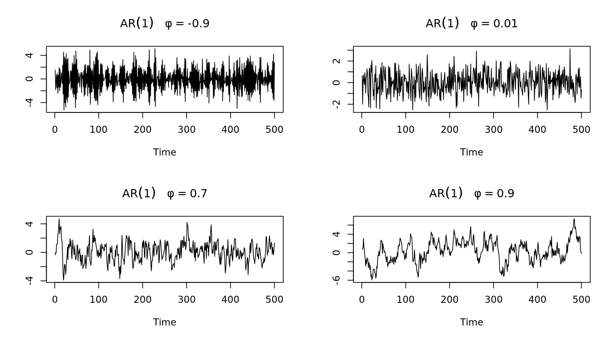

## Generate Time Series Data {-}

### Manually Generated Series


```r
library(forecast)

## Set parameters
n = 500
w = rnorm(n, sd = 1)
x.t = 0

## graphical parameters
par(mfrow = c(1,2))

## White Noise
for (i in 2:n) x.t[i] = w[i]

plot.ts(x.t, main = "White Noise")
Acf(x.t, main = "ACF Plot")
```


```r
## Random Walk, AR(1)
for (i in 2:n) x.t[i] = x.t[i-1] + w[i]
plot.ts(x.t, main = "AR(1) Random Walk")

## Random Walk, AR(2)
for (i in 3:n) x.t[i] = .5*x.t[i-1] - .4*x.t[i-2] + w[i]
plot.ts(x.t, main = "AR(2)")
```


```r
## MA(1)
for (i in 2:n) x.t[i] = w[i] + w[i-1]
plot.ts(x.t, main = "MA(1)")

for (i in 3:n) x.t[i] = w[i] + w[i-1] + w[i-2]
plot.ts(x.t, main = "MA(2)")
```


```r
## graphical parameters
par(mfrow = c(1,1))
```


### Auto Generated Series {-}


```r
## Generated Time Series
plot(arima.sim(n = n, model = list(order = c(0, 0, 0))), main = "White Noise", ylab = "")
```


```r
par(mfrow = c(2, 2))

## AR(1) (correlation between observations) p(h) = phi^h
for (i in c(-.9, .01, .7, .9)) {
  plot(arima.sim(n = n, model = list(ar = i)), main = bquote(AR(1)~~~phi==.(i)), ylab = "")
}
```



```r
## AR(2)
plot(arima.sim(n = n, model = list(order = c(2, 0, 0), ar = c(.2, .1))),
     main = "AR(2)", ylab = "")

## AR(2) with drift
plot(arima.sim(n = n, model = list(order = c(2, 0, 0), ar = c(.2, .1), d = 1.5)),
     main = "AR(2) with drift", ylab = "")

## MA(3)
plot(arima.sim(n = n, model = list(order = c(0, 0, 3), ma = c(.3, .3, .3))),
     main = "MA(3)", ylab = "")

## MA(3) with drift
plot(arima.sim(n = n, model = list(order = c(0, 0, 3), ma = c(.1, .8, .1), d = 2)),
     main = "MA(3) with drift", ylab = "")
```


```r
## ARMA(2,3)
plot(arima.sim(n = n, model = list(order = c(2, 0, 3), ar = c(.4, .2), ma = c(.1, .8, .1))),
     main = "ARMA(2,3)", ylab = "")

## ARIMA(2,1,3)
plot(arima.sim(n = n, model = list(order = c(2, 1, 3), ar = c(.4, .2), ma = c(.1, .8, .1))),
     main = "ARIMA(2,1,3)", ylab = "")
```


