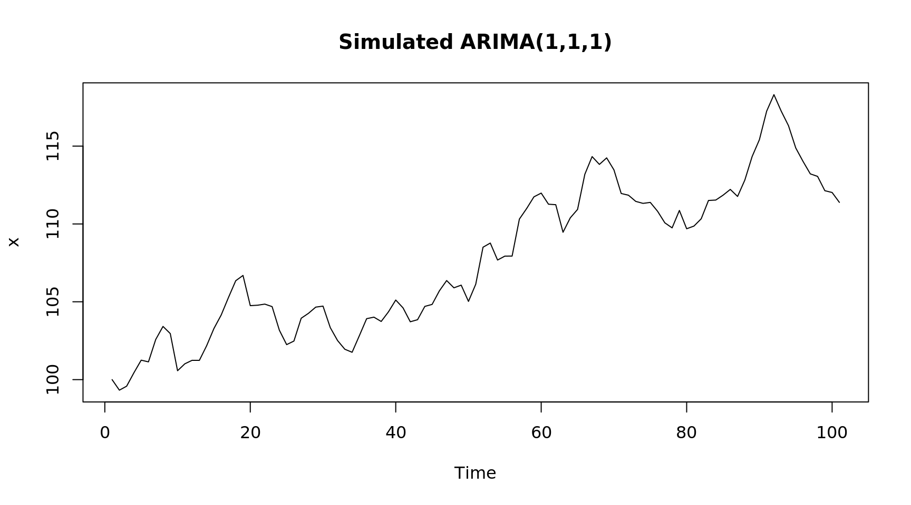
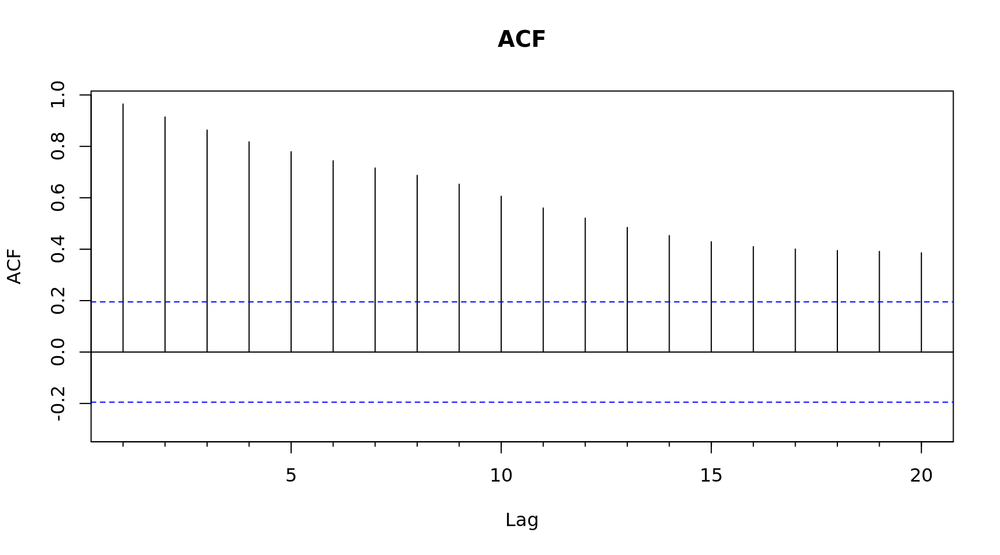
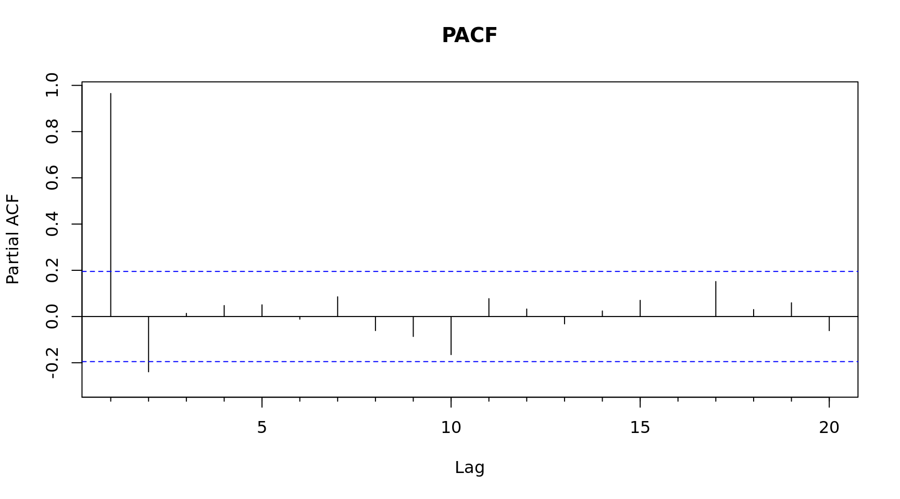
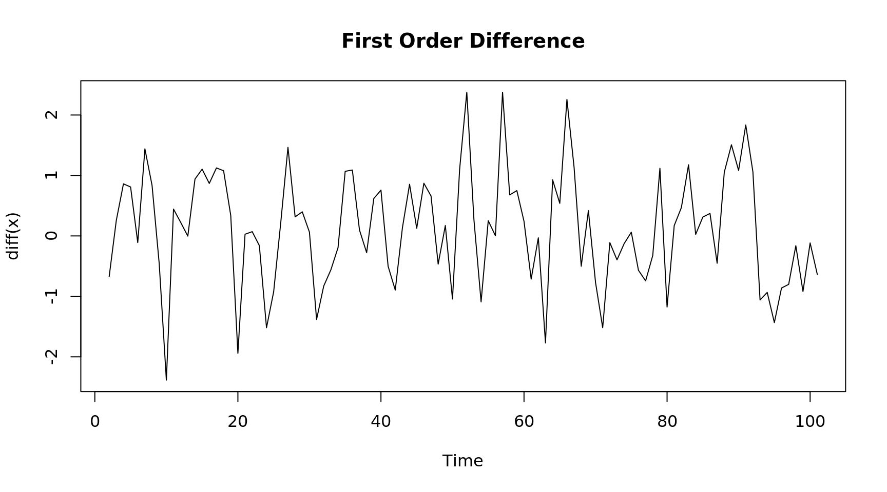
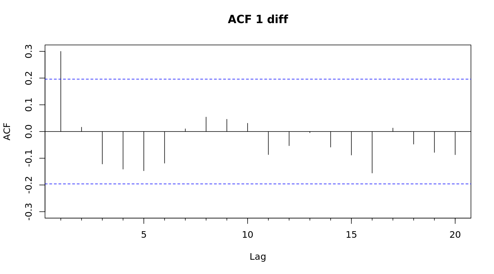
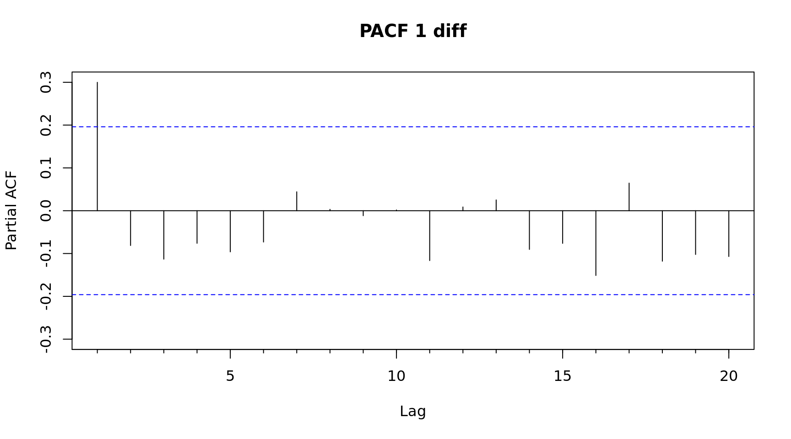

## ARIMA Modeling {-}


```r
library(forecast)

# Generated Time Series
set.seed(1)
x  = 100 + arima.sim(n = 100,
  model = list(order = c(1, 1, 1), ar = .1, ma = .2))

# Plot the series
plot(x, main = "Simulated ARIMA(1,1,1)")
```



```r
# Check if there is auto correlation, there is
Acf(x, main = "ACF"); Pacf(x, main = "PACF")
```



```r
# How many differences does it take for the data to be stationary?
# 1
plot(diff(x), main = "First Order Difference")
```



```r
# Check the Acf/Pacf with differences
Acf(diff(x), main = "ACF 1 diff")  # One significant spike, suggests MA(1)
```



```r
Pacf(diff(x), main = "PACF 1 diff") # One significant spike, indicates AR(1)
```



```r
# Suggested model ARIMA(1,1,1)
mdl1 = arima(x, c(1,1,1))

# How do the ARMA terms compare with the terms used in the sim?
# AR1: .18 vs .1 in the sim
# MA1: .14 vs .2 in the sim
summary(mdl1)
```

```

Call:
arima(x = x, order = c(1, 1, 1))

Coefficients:
         ar1     ma1
      0.1838  0.1449
s.e.  0.2544  0.2499

sigma^2 estimated as 0.7854:  log likelihood = -129.87,  aic = 265.74

Training set error measures:
                     ME      RMSE       MAE        MPE      MAPE     MASE
Training set 0.07980263 0.8818683 0.6973907 0.07372578 0.6471377 0.936633
                     ACF1
Training set -0.005918057
```

```r
# What does the forecast package auto.arima function suggest?
(mdl2 = auto.arima(x)) # No AR term
```

```
Series: x 
ARIMA(0,1,1) 

Coefficients:
         ma1
      0.3043
s.e.  0.0882

sigma^2 estimated as 0.7972:  log likelihood=-130.1
AIC=264.2   AICc=264.32   BIC=269.41
```

```r
# How does the manual model compare with the auto.arima model?
AIC(mdl1, mdl2)
```

```
     df      AIC
mdl1  3 265.7356
mdl2  2 264.1965
```
