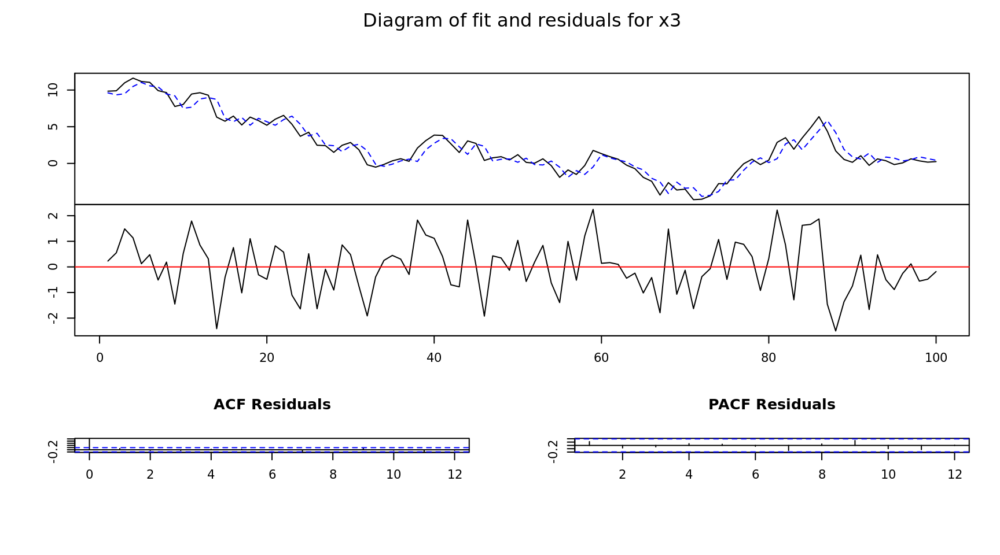

## VAR Modeling {-}


```r
library(vars)

# Generated Time Series
x1  = 10 + arima.sim(n = 100,model = list(order = c(1, 1, 1), ar = .1, ma = .2))
x2  = 10 + arima.sim(n = 100,model = list(order = c(1, 1, 1), ar = .1, ma = .2))
x3  = 10 + arima.sim(n = 100,model = list(order = c(1, 1, 1), ar = .1, ma = .2))
x4  = 10 + arima.sim(n = 100,model = list(order = c(1, 1, 1), ar = .1, ma = .2))

# Combine into a multivariate time series
x = data.frame(x1, x2, x3, x4)

# Create a variable auto-regression modle
mdl = VAR(x)

# Model summary
summary(mdl)
```

```

VAR Estimation Results:
========================= 
Endogenous variables: x1, x2, x3, x4 
Deterministic variables: const 
Sample size: 100 
Log Likelihood: -550.481 
Roots of the characteristic polynomial:
0.9705 0.9411 0.9183 0.799
Call:
VAR(y = x)


Estimation results for equation x1: 
=================================== 
x1 = x1.l1 + x2.l1 + x3.l1 + x4.l1 + const 

       Estimate Std. Error t value Pr(>|t|)    
x1.l1  0.852421   0.061182  13.933   <2e-16 ***
x2.l1 -0.053292   0.056565  -0.942    0.349    
x3.l1  0.003780   0.030598   0.124    0.902    
x4.l1 -0.003551   0.035589  -0.100    0.921    
const  2.506815   1.444862   1.735    0.086 .  
---
Signif. codes:  0 '***' 0.001 '**' 0.01 '*' 0.05 '.' 0.1 ' ' 1


Residual standard error: 1.035 on 95 degrees of freedom
Multiple R-Squared: 0.7241,	Adjusted R-squared: 0.7124 
F-statistic: 62.32 on 4 and 95 DF,  p-value: < 2.2e-16 


Estimation results for equation x2: 
=================================== 
x2 = x1.l1 + x2.l1 + x3.l1 + x4.l1 + const 

       Estimate Std. Error t value Pr(>|t|)    
x1.l1 -0.075582   0.053943  -1.401    0.164    
x2.l1  0.881307   0.049873  17.671   <2e-16 ***
x3.l1 -0.006345   0.026978  -0.235    0.815    
x4.l1 -0.008027   0.031378  -0.256    0.799    
const  2.434378   1.273921   1.911    0.059 .  
---
Signif. codes:  0 '***' 0.001 '**' 0.01 '*' 0.05 '.' 0.1 ' ' 1


Residual standard error: 0.9128 on 95 degrees of freedom
Multiple R-Squared: 0.8194,	Adjusted R-squared: 0.8118 
F-statistic: 107.8 on 4 and 95 DF,  p-value: < 2.2e-16 


Estimation results for equation x3: 
=================================== 
x3 = x1.l1 + x2.l1 + x3.l1 + x4.l1 + const 

      Estimate Std. Error t value Pr(>|t|)    
x1.l1 -0.07556    0.06403  -1.180   0.2409    
x2.l1 -0.11611    0.05920  -1.961   0.0528 .  
x3.l1  0.94696    0.03202  29.570   <2e-16 ***
x4.l1 -0.01750    0.03725  -0.470   0.6395    
const  3.39618    1.51217   2.246   0.0270 *  
---
Signif. codes:  0 '***' 0.001 '**' 0.01 '*' 0.05 '.' 0.1 ' ' 1


Residual standard error: 1.084 on 95 degrees of freedom
Multiple R-Squared: 0.947,	Adjusted R-squared: 0.9448 
F-statistic: 424.8 on 4 and 95 DF,  p-value: < 2.2e-16 


Estimation results for equation x4: 
=================================== 
x4 = x1.l1 + x2.l1 + x3.l1 + x4.l1 + const 

      Estimate Std. Error t value Pr(>|t|)    
x1.l1 -0.06413    0.05696  -1.126    0.263    
x2.l1  0.04873    0.05267   0.925    0.357    
x3.l1 -0.04077    0.02849  -1.431    0.156    
x4.l1  0.94816    0.03314  28.614   <2e-16 ***
const  1.35853    1.34528   1.010    0.315    
---
Signif. codes:  0 '***' 0.001 '**' 0.01 '*' 0.05 '.' 0.1 ' ' 1


Residual standard error: 0.9639 on 95 degrees of freedom
Multiple R-Squared: 0.945,	Adjusted R-squared: 0.9426 
F-statistic: 407.7 on 4 and 95 DF,  p-value: < 2.2e-16 


Covariance matrix of residuals:
         x1      x2       x3      x4
x1  1.07184 -0.1290  0.08087 -0.1130
x2 -0.12900  0.8332 -0.18907  0.1310
x3  0.08087 -0.1891  1.17403 -0.1792
x4 -0.11305  0.1310 -0.17917  0.9292

Correlation matrix of residuals:
         x1      x2       x3      x4
x1  1.00000 -0.1365  0.07209 -0.1133
x2 -0.13651  1.0000 -0.19117  0.1489
x3  0.07209 -0.1912  1.00000 -0.1715
x4 -0.11328  0.1489 -0.17155  1.0000
```

```r
# Plot model
plot(mdl)
```



```r
# Plot forecast
plot(predict(mdl, h = 12))
```


