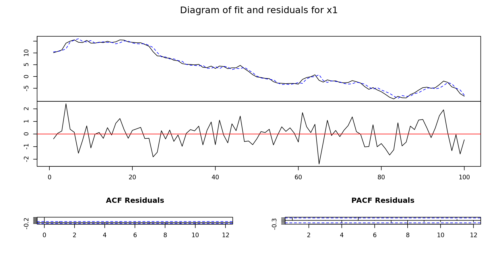

## VAR Modeling {-}


```r
library(vars)

# Generated Time Series
x1  = 10 + arima.sim(n = 100,model = list(order = c(1, 1, 1), ar = .1, ma = .2))
x2  = 10 + arima.sim(n = 100,model = list(order = c(1, 1, 1), ar = .1, ma = .2))
x3  = 10 + arima.sim(n = 100,model = list(order = c(1, 1, 1), ar = .1, ma = .2))
x4  = 10 + arima.sim(n = 100,model = list(order = c(1, 1, 1), ar = .1, ma = .2))

# Combine into a multivariate time series
x = data.frame(x1, x2, x3, x4)

# Create a variable auto-regression modle
mdl = VAR(x)

# Model summary
summary(mdl)
```

```

VAR Estimation Results:
========================= 
Endogenous variables: x1, x2, x3, x4 
Deterministic variables: const 
Sample size: 100 
Log Likelihood: -562.528 
Roots of the characteristic polynomial:
0.9677 0.9395 0.9395 0.8534
Call:
VAR(y = x)


Estimation results for equation x1: 
=================================== 
x1 = x1.l1 + x2.l1 + x3.l1 + x4.l1 + const 

       Estimate Std. Error t value Pr(>|t|)    
x1.l1  0.959497   0.045008  21.319   <2e-16 ***
x2.l1  0.052164   0.051326   1.016   0.3120    
x3.l1 -0.004411   0.043049  -0.102   0.9186    
x4.l1 -0.059537   0.035148  -1.694   0.0936 .  
const  0.419126   1.136497   0.369   0.7131    
---
Signif. codes:  0 '***' 0.001 '**' 0.01 '*' 0.05 '.' 0.1 ' ' 1


Residual standard error: 1.146 on 95 degrees of freedom
Multiple R-Squared: 0.8525,	Adjusted R-squared: 0.8463 
F-statistic: 137.3 on 4 and 95 DF,  p-value: < 2.2e-16 


Estimation results for equation x2: 
=================================== 
x2 = x1.l1 + x2.l1 + x3.l1 + x4.l1 + const 

       Estimate Std. Error t value Pr(>|t|)    
x1.l1  0.043039   0.038719   1.112   0.2691    
x2.l1  0.914072   0.044155  20.702   <2e-16 ***
x3.l1 -0.055735   0.037034  -1.505   0.1357    
x4.l1 -0.003661   0.030237  -0.121   0.9039    
const  1.733010   0.977712   1.773   0.0795 .  
---
Signif. codes:  0 '***' 0.001 '**' 0.01 '*' 0.05 '.' 0.1 ' ' 1


Residual standard error: 0.9857 on 95 degrees of freedom
Multiple R-Squared: 0.9293,	Adjusted R-squared: 0.9263 
F-statistic: 312.1 on 4 and 95 DF,  p-value: < 2.2e-16 


Estimation results for equation x3: 
=================================== 
x3 = x1.l1 + x2.l1 + x3.l1 + x4.l1 + const 

      Estimate Std. Error t value Pr(>|t|)    
x1.l1 -0.01793    0.03876  -0.462   0.6448    
x2.l1 -0.05733    0.04420  -1.297   0.1978    
x3.l1  0.92205    0.03708  24.869   <2e-16 ***
x4.l1 -0.01357    0.03027  -0.448   0.6549    
const  2.41643    0.97881   2.469   0.0153 *  
---
Signif. codes:  0 '***' 0.001 '**' 0.01 '*' 0.05 '.' 0.1 ' ' 1


Residual standard error: 0.9868 on 95 degrees of freedom
Multiple R-Squared: 0.942,	Adjusted R-squared: 0.9396 
F-statistic: 385.8 on 4 and 95 DF,  p-value: < 2.2e-16 


Estimation results for equation x4: 
=================================== 
x4 = x1.l1 + x2.l1 + x3.l1 + x4.l1 + const 

        Estimate Std. Error t value Pr(>|t|)    
x1.l1  0.1434568  0.0383801   3.738 0.000317 ***
x2.l1  0.1387279  0.0437678   3.170 0.002054 ** 
x3.l1  0.0002962  0.0367097   0.008 0.993579    
x4.l1  0.8980475  0.0299720  29.963  < 2e-16 ***
const -2.4737956  0.9691464  -2.553 0.012287 *  
---
Signif. codes:  0 '***' 0.001 '**' 0.01 '*' 0.05 '.' 0.1 ' ' 1


Residual standard error: 0.9771 on 95 degrees of freedom
Multiple R-Squared: 0.9701,	Adjusted R-squared: 0.9688 
F-statistic: 769.9 on 4 and 95 DF,  p-value: < 2.2e-16 


Covariance matrix of residuals:
         x1      x2       x3       x4
x1  1.31282 -0.1843 -0.02528  0.06478
x2 -0.18425  0.9716 -0.15628  0.03490
x3 -0.02528 -0.1563  0.97379 -0.07605
x4  0.06478  0.0349 -0.07605  0.95466

Correlation matrix of residuals:
         x1       x2       x3       x4
x1  1.00000 -0.16314 -0.02236  0.05786
x2 -0.16314  1.00000 -0.16067  0.03624
x3 -0.02236 -0.16067  1.00000 -0.07887
x4  0.05786  0.03624 -0.07887  1.00000
```

```r
# Plot model
plot(mdl)
```



```r
# Plot forecast
plot(predict(mdl, h = 12))
```


