# Forecasting {-}


## Basic Graphical Methods for Time Series {-}


```r
library(forecast)
library(lubridate)

data("AirPassengers")

## Plot of Air Passengers with increasing variance
plot(AirPassengers, main = "Air Passengers 1949 to 1961", ylab = "Passengers")
```

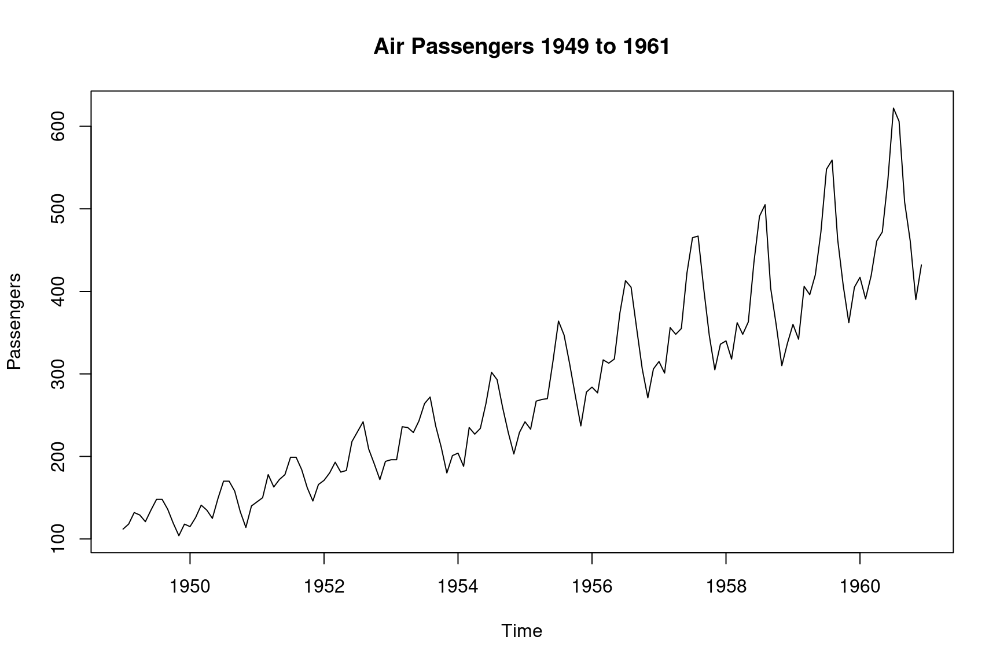

```r
## Seasonal plot by year
seasonplot(AirPassengers, s = 12, main = "Seasonal Plot", ylab = "Passengers", year.labels = TRUE, col = 1:12)
```

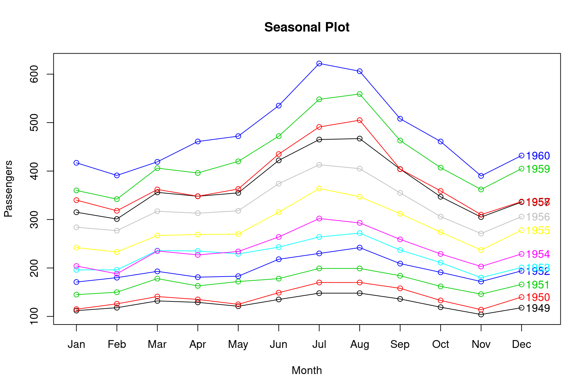

```r
## Seasonal subseries plot
monthplot(AirPassengers, ylab = "Passengers", main = "Seasonal Deviation", labels = month.abb)
```

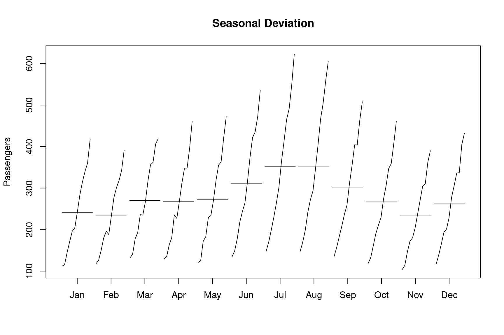

```r
## Autocorrelation
acf(AirPassengers, main = "Autocorrelation")
```

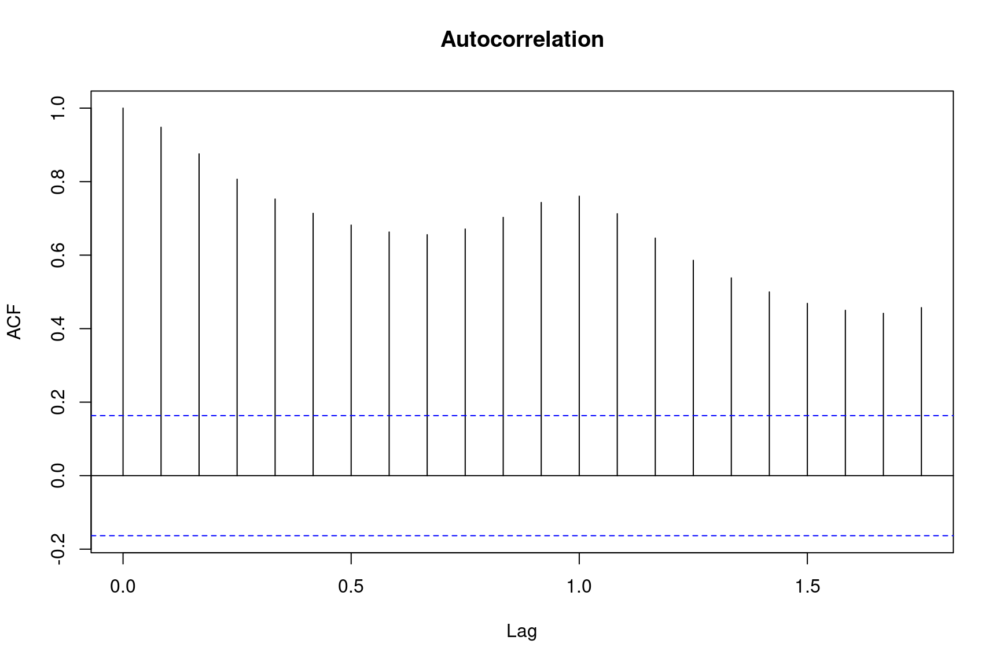

#### Simple Forecasting Methods {-}


```r
## Average Method
method.avg = meanf(AirPassengers, h = 36)

## Naive Method
method.naive = naive(AirPassengers, h = 36)

## Seasonal Naive
method.snaive = snaive(AirPassengers, h = 36)

## Random Walk with Drift
method.rwf = rwf(AirPassengers, h = 36, drift = TRUE)

## Plot of the different methods
plot(AirPassengers, main = "Air Passengers 1949 to 1961", xlim = c(1949, 1964))
lines(method.avg$mean, col = 2)
lines(method.naive$mean, col = 3)
lines(method.snaive$mean, col = 4)
lines(method.rwf$mean, col = 5)
legend("topleft", lty = 1, col = c(2, 3, 4, 5),
       legend = c("Average", "Naive", "Seasonal Naive", "Random Walk"))
```

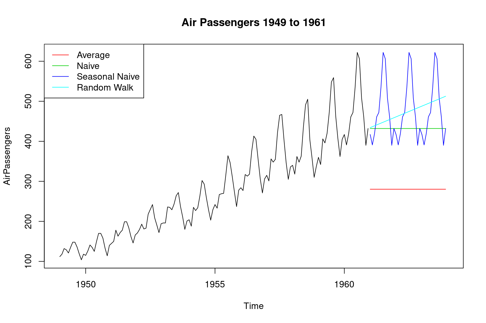

#### Stabalizing Variance {-}


```r
## Box Cox Transformation
(lambda = BoxCox.lambda(AirPassengers))
```

```
[1] -0.2947156
```

```r
## Remove variation from months, create a data.frame first
Air = data.frame(Passengers = AirPassengers)
Air$Date = seq.Date(from = as.Date("1949-01-01"), by = "month", length.out = 144)

## Calculate days per month
Air$Days.per.month = days_in_month(Air$Date)

## Calculate average number of passengers per month removing variation due to number of days
Air$month.avg = with(Air, Passengers / Days.per.month)

## Plots of original data and monthly average under the Box Cox Transformation
par(mfrow = c(2, 1))
plot(BoxCox(Air$Passengers, lambda), ylab = "Passengers", main = "Air Passengers (BCT)")
plot(BoxCox(Air$month.avg, BoxCox.lambda(Air$month.avg)), ylab = "Passengers",
     main = "Passengers Per Month (BCT)")
```

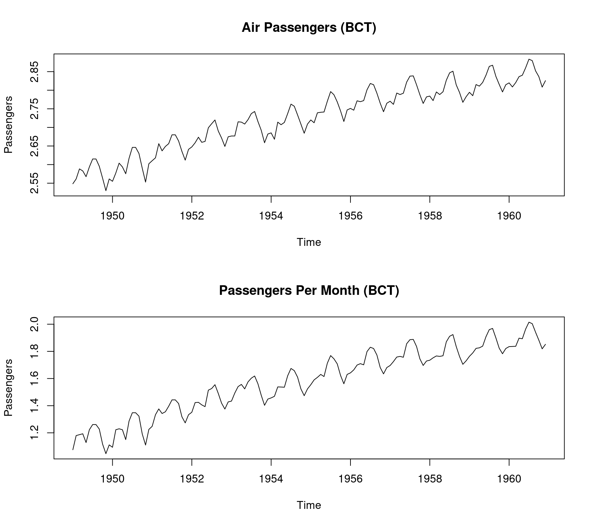


```r
## Decompose average monthly passengers
plot(decompose(Air$month.avg))
```

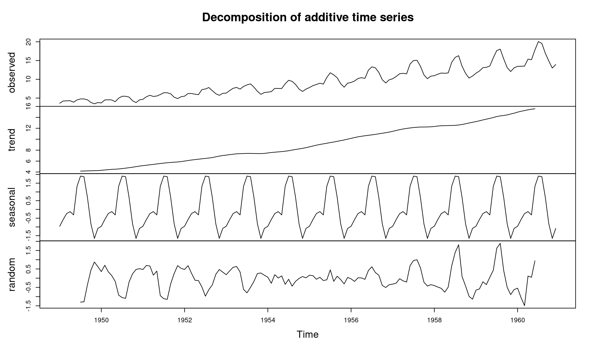

```r
## Decompose average monthly passenegers under Box Cox
## Results better random error
plot(decompose(BoxCox(Air$month.avg, BoxCox.lambda(Air$month.avg))), ylab = "Passengers")
```

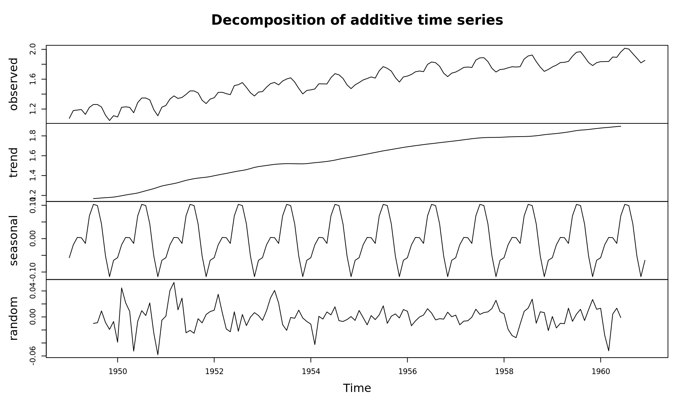


## Generate Time Series Data {-}

### Manually Generated Series


```r
library(forecast)

## Set parameters
n = 500
w = rnorm(n, sd = 1)
x.t = 0

## graphical parameters
par(mfrow = c(1,2))

## White Noise
for (i in 2:n) x.t[i] = w[i]

plot.ts(x.t, main = "White Noise")
Acf(x.t, main = "ACF Plot")
```


```r
## Random Walk, AR(1)
for (i in 2:n) x.t[i] = x.t[i-1] + w[i]
plot.ts(x.t, main = "AR(1) Random Walk")

## Random Walk, AR(2)
for (i in 3:n) x.t[i] = .5*x.t[i-1] - .4*x.t[i-2] + w[i]
plot.ts(x.t, main = "AR(2)")
```

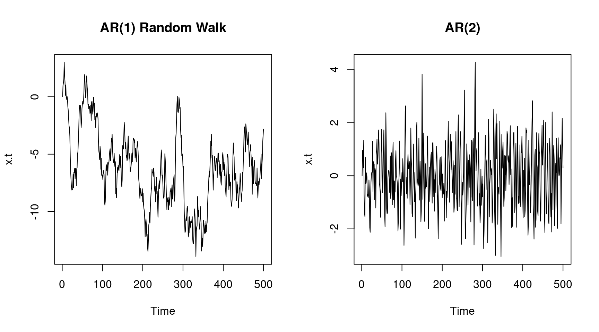

```r
## MA(1)
for (i in 2:n) x.t[i] = w[i] + w[i-1]
plot.ts(x.t, main = "MA(1)")

for (i in 3:n) x.t[i] = w[i] + w[i-1] + w[i-2]
plot.ts(x.t, main = "MA(2)")
```

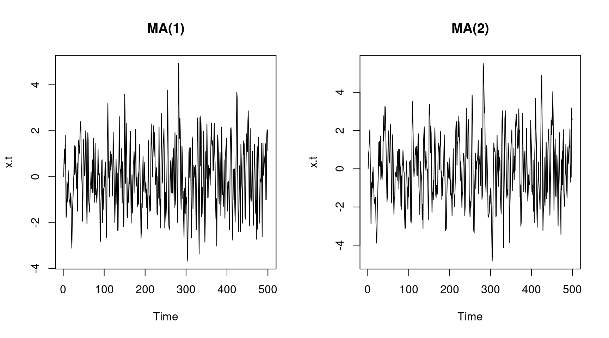

```r
## graphical parameters
par(mfrow = c(1,1))
```


### Auto Generated Series {-}


```r
## Generated Time Series
plot(arima.sim(n = n, model = list(order = c(0, 0, 0))), main = "White Noise", ylab = "")
```

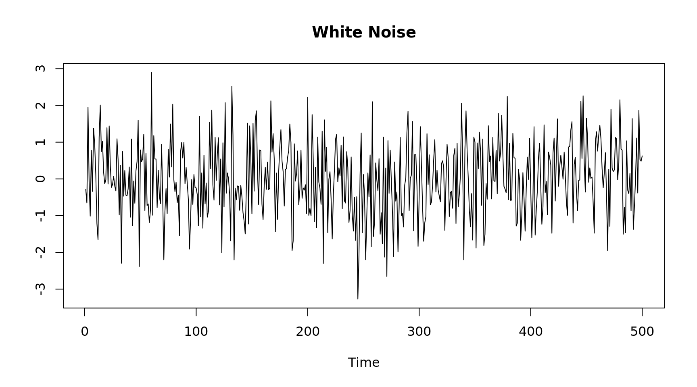

```r
par(mfrow = c(2, 2))

## AR(1) (correlation between observations) p(h) = phi^h
for (i in c(-.9, .01, .7, .9)) {
  plot(arima.sim(n = n, model = list(ar = i)), main = bquote(AR(1)~~~phi==.(i)), ylab = "")
}
```

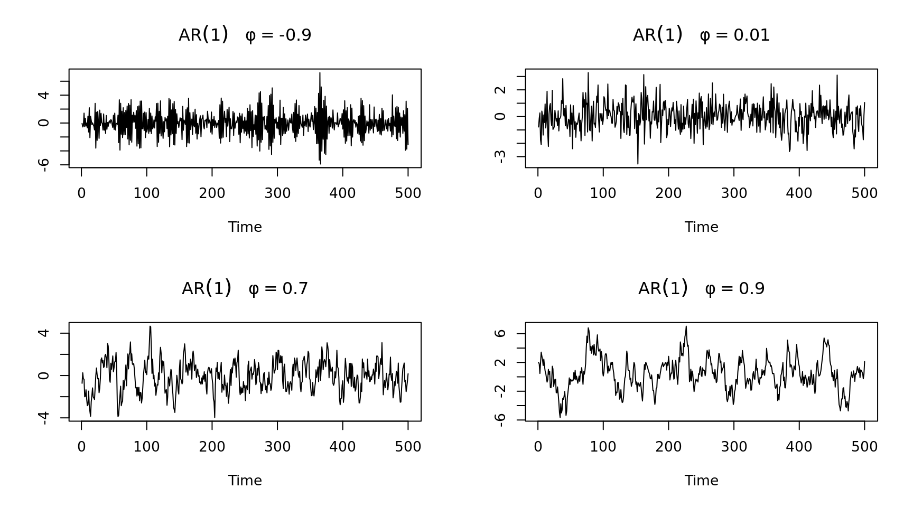

```r
## AR(2)
plot(arima.sim(n = n, model = list(order = c(2, 0, 0), ar = c(.2, .1))),
     main = "AR(2)", ylab = "")

## AR(2) with drift
plot(arima.sim(n = n, model = list(order = c(2, 0, 0), ar = c(.2, .1), d = 1.5)),
     main = "AR(2) with drift", ylab = "")

## MA(3)
plot(arima.sim(n = n, model = list(order = c(0, 0, 3), ma = c(.3, .3, .3))),
     main = "MA(3)", ylab = "")

## MA(3) with drift
plot(arima.sim(n = n, model = list(order = c(0, 0, 3), ma = c(.1, .8, .1), d = 2)),
     main = "MA(3) with drift", ylab = "")
```

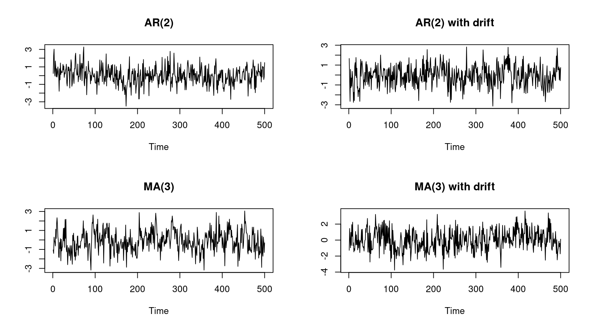

```r
## ARMA(2,3)
plot(arima.sim(n = n, model = list(order = c(2, 0, 3), ar = c(.4, .2), ma = c(.1, .8, .1))),
     main = "ARMA(2,3)", ylab = "")

## ARIMA(2,1,3)
plot(arima.sim(n = n, model = list(order = c(2, 1, 3), ar = c(.4, .2), ma = c(.1, .8, .1))),
     main = "ARIMA(2,1,3)", ylab = "")
```

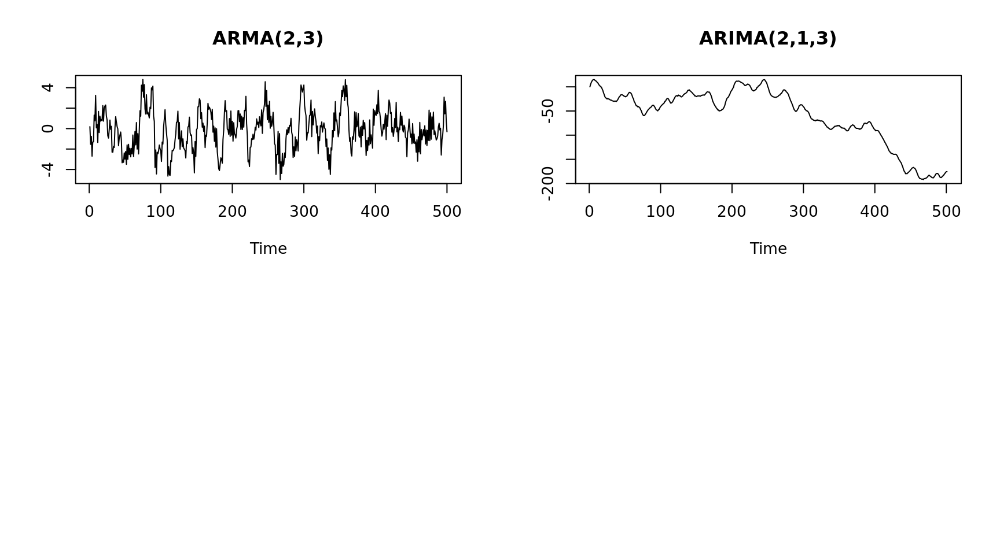
