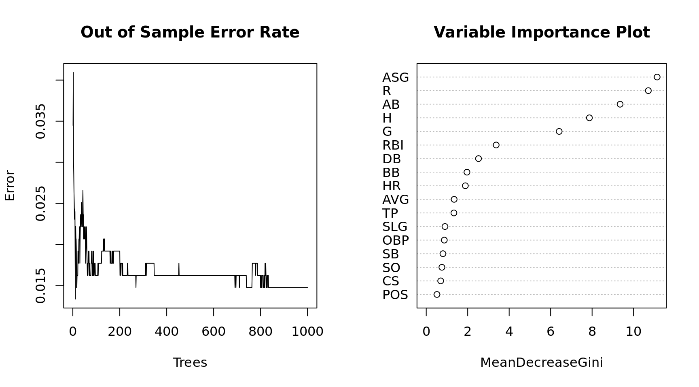
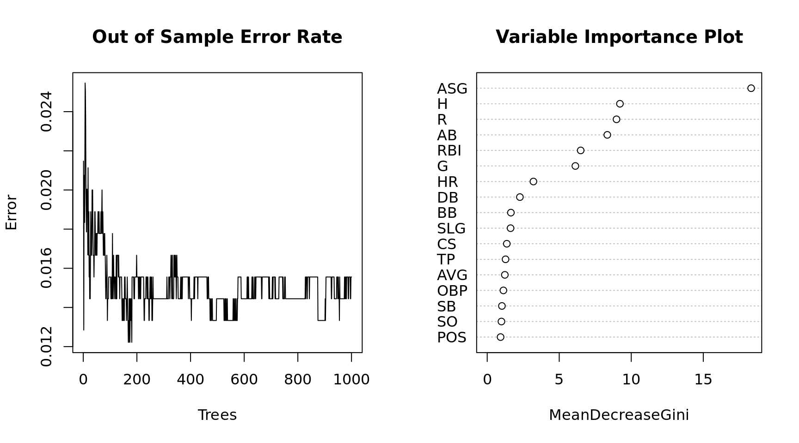

## Random Forest {-}

##### Background {-}

The following dataset are career stats for over 1000 MLB baseball players. The data consists of the position of each player along with 19 numeric variables measure offense. The training set consists of 677 observations and the testing set has 339 observations. The objective is to build a model that will predict whether a player is in the Hall of Fame based on his career statistics. Since so few players make it to the Hall of Fame, the methodology for scoring the accuracy of models is based on the following calculation: $(sensitivity + 3*specificity) / 4$. The objective is to get as few incorrect predictions as possible, but having fewer false positives will affect the accuracy measure more than false negatives.


```r
## required packages
library(randomForest)

## Training and Testing Data
hof.train = read.csv("data/HOF_tr.csv"); hof.test = read.csv("data/HOF_te.csv")

## remove unwanted columns
hof.train = hof.train[, -c(2:4)]; hof.test = hof.test[, -c(2:4)]

head(hof.train)
```

```
  HOF POS  ASG    G    AB    R    H  DB  TP  HR  RBI  SB  CS   BB   SO AVG
1   Y  OF 0.75 2440  9288 1383 3141 543  85 135 1138 319 125  790  434 338
2   Y  SS 0.56 2601 10230 1335 2677 394  92  83  791 506 136  736  742 262
3   Y  OF 0.83 1783  7244 1071 2304 414  57 207 1085 134  76  450  965 318
4   Y  1B 0.38 3026 11336 1627 3255 560  35 504 1917 110  43 1333 1516 287
5   Y  1B 0.95 2469  9315 1424 3053 445 112  92 1015 353 187 1018 1028 328
6   Y  1B 0.41 2124  7927 1131 2351 417  27 379 1365 142  80  588 1169 297
  SLG OBP
1 459 388
2 343 311
3 477 360
4 476 359
5 429 393
6 499 350
```

```r
summary(hof.train)
```

```
 HOF     POS           ASG               G              AB       
 N:644   1B: 77   Min.   :0.0000   Min.   : 253   Min.   :  559  
 Y: 33   2B: 83   1st Qu.:0.0000   1st Qu.: 924   1st Qu.: 2626  
         3B: 71   Median :0.0000   Median :1294   Median : 4101  
         C :122   Mean   :0.1022   Mean   :1336   Mean   : 4323  
         OF:244   3rd Qu.:0.1500   3rd Qu.:1666   3rd Qu.: 5536  
         SS: 80   Max.   :0.9500   Max.   :3081   Max.   :11551  
       R                H              DB            TP        
 Min.   :  37.0   Min.   :  90   Min.   : 14   Min.   :  0.00  
 1st Qu.: 308.0   1st Qu.: 656   1st Qu.:109   1st Qu.: 12.00  
 Median : 522.0   Median :1064   Median :183   Median : 24.00  
 Mean   : 574.9   Mean   :1157   Mean   :199   Mean   : 30.19  
 3rd Qu.: 760.0   3rd Qu.:1502   3rd Qu.:260   3rd Qu.: 41.00  
 Max.   :2295.0   Max.   :3283   Max.   :668   Max.   :166.00  
       HR             RBI               SB                CS        
 Min.   :  1.0   Min.   :  44.0   Min.   :   0.00   Min.   :  0.00  
 1st Qu.: 34.0   1st Qu.: 268.0   1st Qu.:  14.00   1st Qu.: 15.00  
 Median : 80.0   Median : 443.0   Median :  42.00   Median : 31.00  
 Mean   :113.9   Mean   : 538.1   Mean   :  84.64   Mean   : 42.07  
 3rd Qu.:155.0   3rd Qu.: 708.0   3rd Qu.:  98.00   3rd Qu.: 57.00  
 Max.   :660.0   Max.   :1917.0   Max.   :1406.00   Max.   :335.00  
       BB             SO            AVG             SLG       
 Min.   :  29   Min.   :  71   Min.   :161.0   Min.   :222.0  
 1st Qu.: 221   1st Qu.: 362   1st Qu.:249.0   1st Qu.:350.0  
 Median : 364   Median : 565   Median :261.0   Median :392.0  
 Mean   : 436   Mean   : 643   Mean   :261.5   Mean   :392.7  
 3rd Qu.: 583   3rd Qu.: 842   3rd Qu.:273.0   3rd Qu.:433.0  
 Max.   :2190   Max.   :2597   Max.   :338.0   Max.   :557.0  
      OBP       
 Min.   :203.0  
 1st Qu.:311.0  
 Median :328.0  
 Mean   :328.8  
 3rd Qu.:347.0  
 Max.   :415.0  
```

```r
## Simple Random Forest
(mdl = randomForest(HOF ~ ., ntree = 1000, data = hof.train))
```

```

Call:
 randomForest(formula = HOF ~ ., data = hof.train, ntree = 1000) 
               Type of random forest: classification
                     Number of trees: 1000
No. of variables tried at each split: 4

        OOB estimate of  error rate: 1.62%
Confusion matrix:
    N  Y class.error
N 640  4  0.00621118
Y   7 26  0.21212121
```

```r
## Function for testing accuracy
metric = function(confusion) {
  sensitivity = confusion[4] / (confusion[2] + confusion[4])
  specificity = confusion[1] / (confusion[1] + confusion[3])
  score = (sensitivity + (3 * specificity)) / 4
  return(score)
}

## Plot of the model performance
par(mfrow = c(1, 2))
plot(x = 1:1000, y = mdl$err.rate[,1], xlab = "Trees", ylab = "Error", type = "l",
     main = "Out of Sample Error Rate")
varImpPlot(mdl, main = "Variable Importance Plot")
```



##### Testing Model Accuracy on New Data {-}

Now that we have a trained model, we will apply the model to data that was not used in the training set. We will calculate the same accuracy score and compare the two.  If they are wildly different we may have a problem with overfitting.


```r
## predict the probability of HOF
estimate = data.frame(predict(mdl, hof.test, type = "prob"))
estimate$predict = predict(mdl, hof.test)
estimate$actual = hof.test$HOF

## Generate a confusion matrix
(confusion = table(estimate[, 3:4]))
```

```
       actual
predict   N   Y
      N 321   2
      Y   2  14
```

```r
## Final Accuracy Measure
(test.metric = metric(confusion))
```

```
[1] 0.964106
```

The random forest method is fairly robust to overfitting because it reserves some of the training data to use as test data which is called Out of Bag (OOB error). Because of this internal mechanism we could probably ues a larger portion of the overall data to train. The next sections tests this to see if accuracy is improved.


```r
hof = rbind(hof.train, hof.test)

## create a training and testing set by randomly sampling from all of the data
set.seed(1002)
x = sample(nrow(hof), replace = FALSE)

## lets train the model on about 90% of the data
train = hof[x[1:900], ]
test = hof[-x[1:900], ]

## build the model
(mdl = randomForest(HOF ~ ., ntree = 1000, data = train))
```

```

Call:
 randomForest(formula = HOF ~ ., data = train, ntree = 1000) 
               Type of random forest: classification
                     Number of trees: 1000
No. of variables tried at each split: 4

        OOB estimate of  error rate: 1.56%
Confusion matrix:
    N  Y class.error
N 858  3 0.003484321
Y  11 28 0.282051282
```

```r
## predict the probability of HOF
estimate = data.frame(predict(mdl, test, type = "prob"))
estimate$predict = predict(mdl, test)
estimate$actual = test$HOF

## confusion matrix
(confusion = table(estimate[, 3:4]))
```

```
       actual
predict   N   Y
      N 106   2
      Y   0   8
```

```r
(test.metric = metric(confusion))
```

```
[1] 0.9861111
```

```r
## model plots
par(mfrow = c(1, 2))
plot(x = 1:1000, y = mdl$err.rate[,1], xlab = "Trees", ylab = "Error", type = "l",
     main = "Out of Sample Error Rate")
varImpPlot(mdl, main = "Variable Importance Plot")
```




We get slightly better results from increasing the training set. The Random Forest model is predicting Yes to Hall of Fame if it measures the probability > .5.  Since it is is so rare that a player gets voted to the Hall of Fame how accurate is the model if we lower the threshold? Based on a review of some of the false negatives I will make the minimum threshold for predicting yes .33


```r
## predict the probability of HOF
estimate = data.frame(predict(mdl, test, type = "prob"))
estimate$predict = "N"
estimate$predict[which(estimate$Y > .33)] = "Y"
estimate$actual = test$HOF

## confusion matrix
(confusion = table(estimate[, 3:4]))
```

```
       actual
predict   N   Y
      N 106   0
      Y   0  10
```

```r
(test.metric = metric(confusion))
```

```
[1] 1
```
