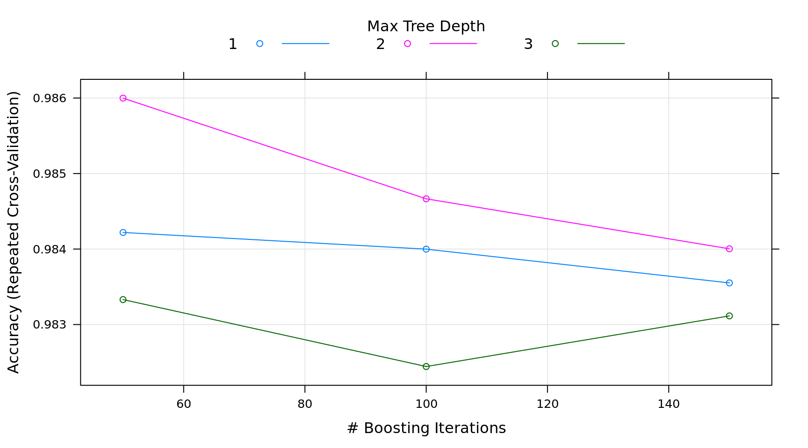

## Gradient Boosting {-}


```r
## required packages
library(caret)
library(gbm)

## Training and Testing Data
hof.train = read.csv("data/HOF_tr.csv");
hof.test = read.csv("data/HOF_te.csv")

hof = rbind(hof.train, hof.test)
hof$HOF = as.factor(as.numeric(hof$HOF) - 1)

## create a training and testing set by randomly sampling from all of the data
## using the same set as in the random forest example
set.seed(1002)
x = sample(nrow(hof), replace = FALSE)

## remove unwanted columns
hof = hof[, -c(2:4)]

## lets train the model on about 90% of the data
train = hof[x[1:900], ]
test = hof[-x[1:900], ]

head(train)
```

```
    HOF POS  ASG    G   AB    R    H  DB TP  HR  RBI  SB  CS  BB   SO AVG
453   0  1B 0.44 2071 7030 1105 1921 295 48 370 1274  63  31 943 1137 273
803   0  SS 0.00  568 1104  142  260  43 10  37  109   7   5  94  220 236
621   0   C 0.00  476 1125   89  267  41  5  18  108   1   0  43  159 237
230   0  OF 0.12 1912 6787  926 1884 334 69 164  824 312 134 468 1266 278
379   0  OF 0.17 1457 4843  737 1399 212 60 142  661  89  68 644  591 289
720   0  OF 0.09 1221 3895  540 1020 175 37 112  485  45  30 351  574 262
    SLG OBP
453 487 359
803 393 304
621 331 268
230 420 325
379 445 371
720 412 323
```

```r
summary(train)
```

```
 HOF     POS           ASG               G                AB       
 0:861   1B: 96   Min.   :0.0000   Min.   : 140.0   Min.   :  252  
 1: 39   2B:105   1st Qu.:0.0000   1st Qu.: 937.5   1st Qu.: 2628  
         3B:100   Median :0.0000   Median :1286.0   Median : 4034  
         C :158   Mean   :0.1028   Mean   :1338.3   Mean   : 4335  
         OF:331   3rd Qu.:0.1500   3rd Qu.:1666.2   3rd Qu.: 5607  
         SS:110   Max.   :0.9500   Max.   :3308.0   Max.   :12364  
       R                H                DB              TP        
 Min.   :  20.0   Min.   :  48.0   Min.   :  6.0   Min.   :  0.00  
 1st Qu.: 308.5   1st Qu.: 660.2   1st Qu.:110.8   1st Qu.: 12.00  
 Median : 511.5   Median :1061.0   Median :180.0   Median : 24.00  
 Mean   : 574.8   Mean   :1159.5   Mean   :199.4   Mean   : 30.44  
 3rd Qu.: 756.0   3rd Qu.:1531.2   3rd Qu.:264.0   3rd Qu.: 41.00  
 Max.   :2295.0   Max.   :3771.0   Max.   :725.0   Max.   :177.00  
       HR              RBI               SB                CS        
 Min.   :  0.00   Min.   :  21.0   Min.   :   0.00   Min.   :  0.00  
 1st Qu.: 37.75   1st Qu.: 280.5   1st Qu.:  15.00   1st Qu.: 15.00  
 Median : 81.00   Median : 447.0   Median :  40.50   Median : 30.00  
 Mean   :115.15   Mean   : 540.9   Mean   :  84.33   Mean   : 41.81  
 3rd Qu.:155.00   3rd Qu.: 708.0   3rd Qu.: 101.25   3rd Qu.: 57.00  
 Max.   :755.00   Max.   :2297.0   Max.   :1406.00   Max.   :335.00  
       BB               SO              AVG             SLG       
 Min.   :  17.0   Min.   :  35.0   Min.   :161.0   Min.   :222.0  
 1st Qu.: 226.8   1st Qu.: 375.5   1st Qu.:248.0   1st Qu.:351.0  
 Median : 363.0   Median : 569.0   Median :262.0   Median :392.5  
 Mean   : 435.3   Mean   : 643.5   Mean   :261.3   Mean   :393.2  
 3rd Qu.: 567.0   3rd Qu.: 841.2   3rd Qu.:274.0   3rd Qu.:432.0  
 Max.   :2190.0   Max.   :2597.0   Max.   :338.0   Max.   :565.0  
      OBP       
 Min.   :203.0  
 1st Qu.:310.0  
 Median :327.0  
 Mean   :328.2  
 3rd Qu.:347.0  
 Max.   :417.0  
```

```r
## build model
fitControl = trainControl(method = "repeatedCV", number = 5, repeats = 5)
mdl = train(HOF ~ ., data = train, method = "gbm", trControl = fitControl,
            verbose = FALSE)

## Model Summary
mdl; plot(mdl)
```

```
Stochastic Gradient Boosting 

900 samples
 17 predictor
  2 classes: '0', '1' 

No pre-processing
Resampling: Cross-Validated (5 fold, repeated 5 times) 
Summary of sample sizes: 720, 720, 720, 719, 721, 720, ... 
Resampling results across tuning parameters:

  interaction.depth  n.trees  Accuracy   Kappa    
  1                   50      0.9842196  0.7910195
  1                  100      0.9839986  0.7934159
  1                  150      0.9835517  0.7899395
  2                   50      0.9859986  0.8179582
  2                  100      0.9846653  0.8038399
  2                  150      0.9840035  0.7949731
  3                   50      0.9833307  0.7767886
  3                  100      0.9824443  0.7725392
  3                  150      0.9831146  0.7844066

Tuning parameter 'shrinkage' was held constant at a value of 0.1

Tuning parameter 'n.minobsinnode' was held constant at a value of 10
Accuracy was used to select the optimal model using  the largest value.
The final values used for the model were n.trees = 50, interaction.depth
 = 2, shrinkage = 0.1 and n.minobsinnode = 10.
```



```r
x = predict(mdl, test, type = "prob")

## compile results
results = data.frame(
  Actual = test$HOF,
  Prob.N = x[, 1],
  Prob.Y = x[, 2]
)

## code 0/1 back to N/Y
results$Actual = as.character(results$Actual)
results$Actual[results$Actual == '0'] = 'N'
results$Actual[results$Actual == '1'] = 'Y'
results$Actual = factor(results$Actual)

## if probability of HOF is > .5 then score a Y
results$Prediction = "N"
results$Prediction[results$Prob.Y >= .5] = "Y"
results$Prediction = factor(results$Prediction)

## accuracy calculation from the random forest example
metric = function(confusion) {
  sensitivity = confusion[4] / (confusion[2] + confusion[4])
  specificity = confusion[1] / (confusion[1] + confusion[3])
  score = (sensitivity + (3 * specificity)) / 4
  return(score)
}

## confusion matrix and accuracy score
(confusion = table(Prediction = results$Prediction, Actual = results$Actual))
```

```
          Actual
Prediction   N   Y
         N 106   2
         Y   0   8
```

```r
## accuracy score for training set
metric(confusion)
```

```
[1] 0.9861111
```

```r
## look at the incorrect responses and see if we can lower the threshold with creating
## false positives
summary(results); subset(results, Actual != Prediction)
```

```
 Actual      Prob.N             Prob.Y         Prediction
 N:106   Min.   :0.001712   Min.   :0.001282   N:108     
 Y: 10   1st Qu.:0.998683   1st Qu.:0.001317   Y:  8     
         Median :0.998683   Median :0.001317             
         Mean   :0.935894   Mean   :0.064106             
         3rd Qu.:0.998683   3rd Qu.:0.001317             
         Max.   :0.998718   Max.   :0.998288             
```

```
   Actual    Prob.N     Prob.Y Prediction
1       Y 0.9691392 0.03086077          N
78      Y 0.7711650 0.22883501          N
```

```r
min.pred = min(subset(results, Actual != Prediction, "Prob.Y"))

## it looks like there is no danger of lowering the threshold
results$Prediction.new = "N"
results$Prediction.new[results$Prob.Y >= min.pred] = "Y"

## confusion matrix and accuracy score
(confusion = table(Prediction = results$Prediction.new, Actual = results$Actual))
```

```
          Actual
Prediction   N   Y
         N 102   0
         Y   4  10
```

```r
## accuracy score for training set
metric(confusion)
```

```
[1] 0.9285714
```

```r
## there are fewer incorrect answers, but the penalty for false positives are greater
## than false negatives so the accuracy score is actually lower
```
