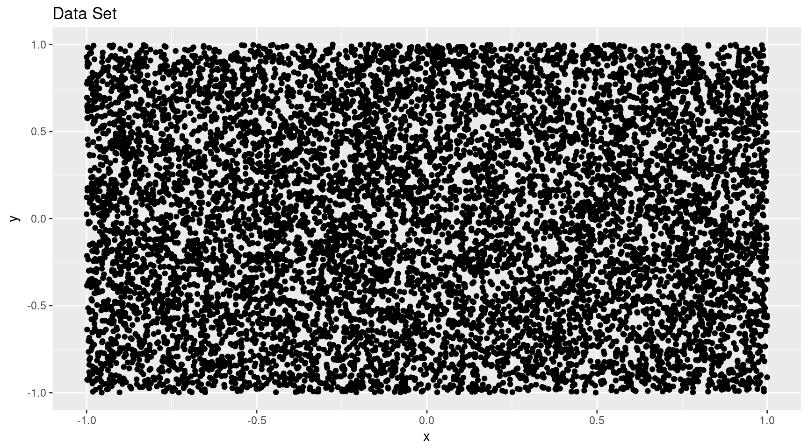
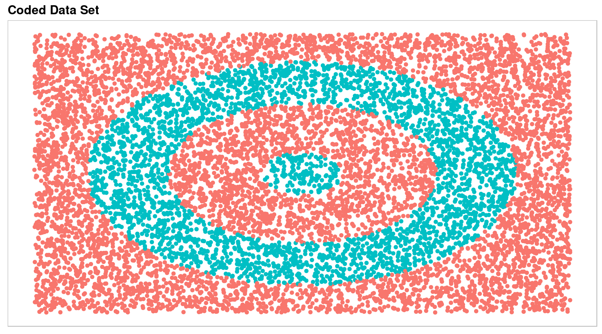
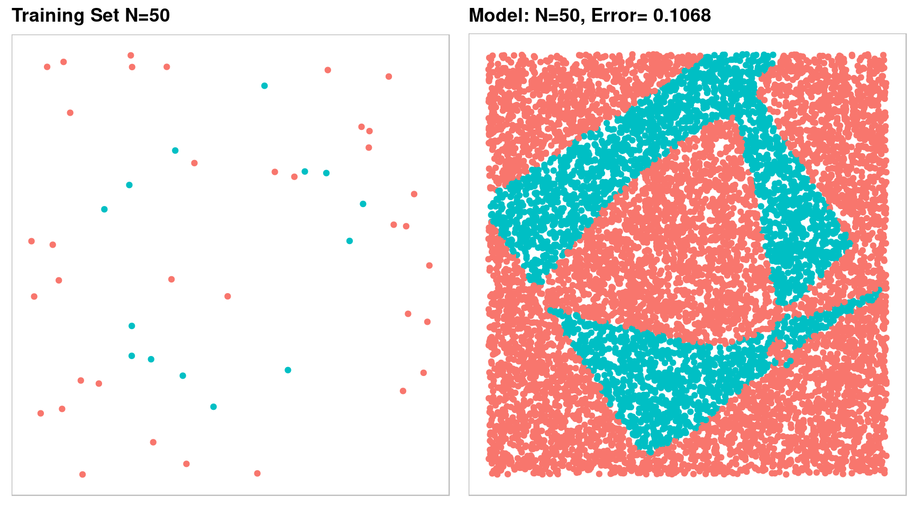
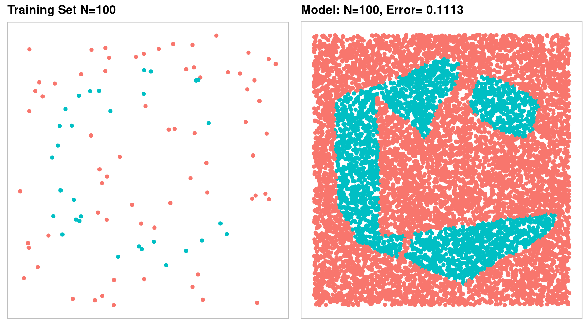
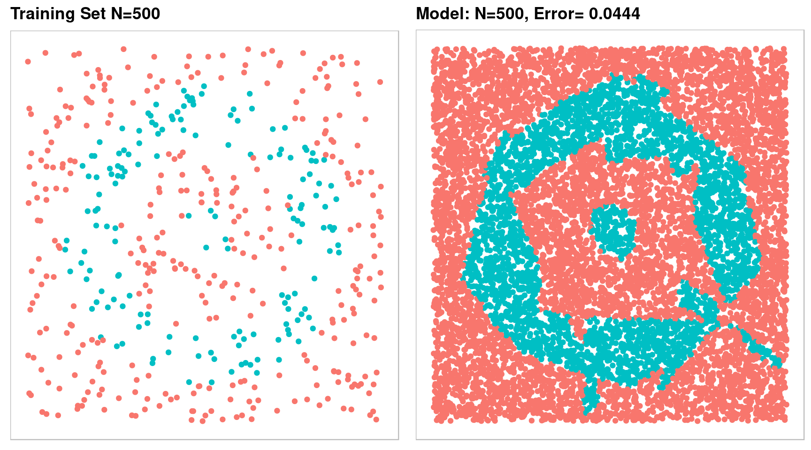
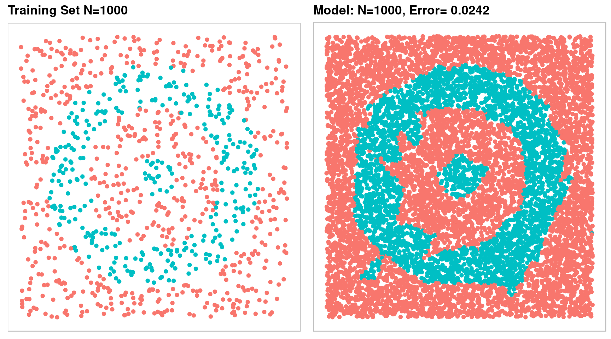
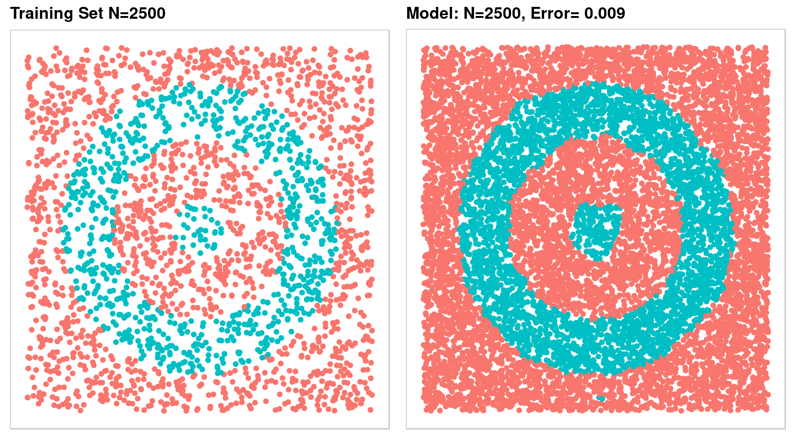
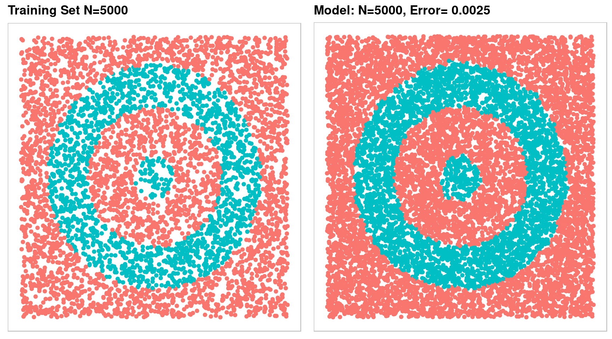
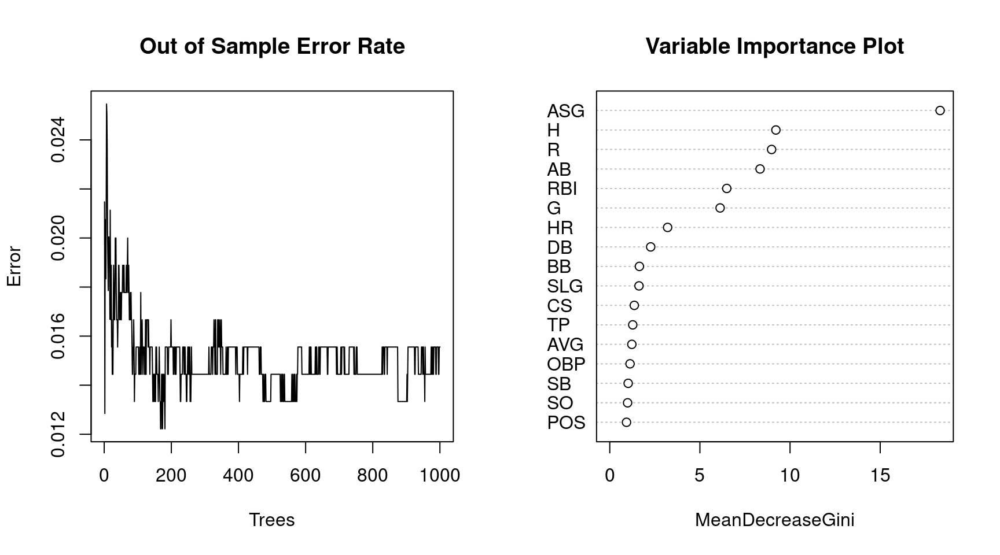
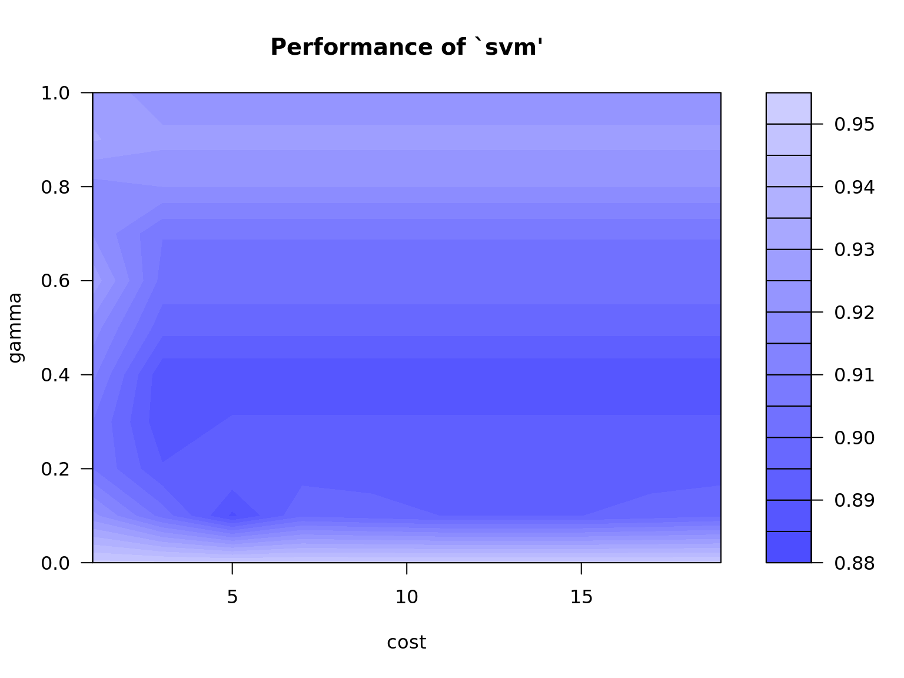

# Machine Learning {-}


```r
## Required Packages
library(neuralnet)
library(ggplot2)
library(nnet)
library(gridExtra)

## Set up parameters for the NN
n = 10000
size = 50
maxit = 500

## Generate Random Data fron the Uniform Distribution
set.seed(10)
x = runif(n, min = -1, max = 1)
y = runif(n, min = -1, max = 1)
dt = data.frame(x, y)

## Quick Plot of Data
qplot(x = x, y = y, geom = "point", data = dt, main = "Data Set")
```



```r
## Calculate the distance to the origin
dt$dto = with(dt, sqrt(x^2 + y^2))

## Create a bullseye basid on distance to origin
dt$code = 0
dt$code[dt$dto < .8] = 1
dt$code[dt$dto < .5] = 0
dt$code[dt$dto < .15] = 1

## Code the indicator
dt$code2 = class.ind(dt$code)


## Create a custom plot theme
theme_jeb = function() {
  theme(panel.background = element_blank(),
        panel.border = element_rect(color = "gray", fill = NA),
        panel.grid = element_blank(),
        axis.text = element_blank(),
        axis.ticks = element_blank(),
        axis.title = element_blank(),
        plot.title = element_text(face = "bold"))
}

## Main plot of the testing set
g1 = ggplot(dt, aes(x = x, y = y)) +
  geom_point(aes(col = factor(code))) +
  scale_color_discrete(guide = FALSE) +
  ggtitle("Coded Data Set") +
  theme_jeb()

g1
```



```r
## Train the NN from 50 random samples of the data set
samp = sample(n, 50, replace = FALSE)
mdl = nnet(code2 ~ x + y, data = dt[samp,], size = size, softmax = TRUE,
           maxit = maxit, trace = FALSE)
dt$out = factor(predict(mdl, dt, type = "class"))


g2 = ggplot(dt[samp, ], aes(x = x, y = y)) +
  geom_point(aes(col = factor(code))) +
  scale_color_discrete(guide = FALSE) +
  ggtitle("Training Set N=50") +
  theme_jeb()

g3 = ggplot(dt, aes(x = x, y = y)) +
  geom_point(aes(col = out)) +
  scale_color_discrete(guide = FALSE) +
  ggtitle(paste("Model: N=50,", "Error=",
                length(which(as.numeric(dt$out)-as.numeric(dt$code) == 0))/n)) +
  theme_jeb()

grid.arrange(g2, g3, nrow = 1)
```



```r
## 100 random samples
samp = sample(n, 100, replace = FALSE)
mdl = nnet(code2 ~ x + y, data = dt[samp,], size = size, softmax = TRUE,
           maxit = maxit, trace = FALSE)
dt$out.100 = factor(predict(mdl, dt, type = "class"))

g4 = ggplot(dt[samp, ], aes(x = x, y = y)) +
  geom_point(aes(col = factor(code))) +
  scale_color_discrete(guide = FALSE) +
  ggtitle("Training Set N=100") +
  theme_jeb()

g5 = ggplot(dt, aes(x = x, y = y)) +
  geom_point(aes(col = out.100)) +
  scale_color_discrete(guide = FALSE) +
  ggtitle(paste("Model: N=100,", "Error=",
                length(which(as.numeric(dt$out.100)-as.numeric(dt$code) == 0))/n)) +
  theme_jeb()

grid.arrange(g4, g5, nrow = 1)
```



```r
## 500 random samples
samp = sample(n, 500, replace = FALSE)
mdl = nnet(code2 ~ x + y, data = dt[samp,], size = size, softmax = TRUE,
           maxit = maxit, trace = FALSE)
dt$out.500 = factor(predict(mdl, dt, type = "class"))

g6 = ggplot(dt[samp, ], aes(x = x, y = y)) +
  geom_point(aes(col = factor(code))) +
  scale_color_discrete(guide = FALSE) +
  ggtitle("Training Set N=500") +
  theme_jeb()

g7 = ggplot(dt, aes(x = x, y = y)) +
  geom_point(aes(col = out.500)) +
  scale_color_discrete(guide = FALSE) +
  ggtitle(paste("Model: N=500,", "Error=",
                length(which(as.numeric(dt$out.500)-as.numeric(dt$code) == 0))/n)) +
  theme_jeb()

grid.arrange(g6, g7, nrow = 1)
```



```r
## 1000 random samples
samp = sample(n, 1000, replace = FALSE)
mdl = nnet(code2 ~ x + y, data = dt[samp,], size = size, softmax = TRUE,
           maxit = maxit, trace = FALSE)
dt$out.1000 = factor(predict(mdl, dt, type = "class"))

g8 = ggplot(dt[samp, ], aes(x = x, y = y)) +
  geom_point(aes(col = factor(code))) +
  scale_color_discrete(guide = FALSE) +
  ggtitle("Training Set N=1000") +
  theme_jeb()

g9 = ggplot(dt, aes(x = x, y = y)) +
  geom_point(aes(col = out.1000)) +
  scale_color_discrete(guide = FALSE) +
  ggtitle(paste("Model: N=1000,", "Error=",
                length(which(as.numeric(dt$out.1000)-as.numeric(dt$code) == 0))/n)) +
  theme_jeb()

grid.arrange(g8, g9, nrow = 1)
```



```r
## 2500 random samples
samp = sample(n, 2500, replace = FALSE)
mdl = nnet(code2 ~ x + y, data = dt[samp,], size = size, softmax = TRUE,
           maxit = maxit, trace = FALSE)
dt$out.2500 = factor(predict(mdl, dt, type = "class"))

g10 = ggplot(dt[samp, ], aes(x = x, y = y)) +
  geom_point(aes(col = factor(code))) +
  scale_color_discrete(guide = FALSE) +
  ggtitle("Training Set N=2500") +
  theme_jeb()

g11 = ggplot(dt, aes(x = x, y = y)) +
  geom_point(aes(col = out.2500)) +
  scale_color_discrete(guide = FALSE) +
  ggtitle(paste("Model: N=2500,", "Error=",
                length(which(as.numeric(dt$out.2500)-as.numeric(dt$code) == 0))/n)) +
  theme_jeb()

grid.arrange(g10, g11, nrow = 1)
```



```r
## 5000 random samples
samp = sample(n, 5000, replace = FALSE)
mdl = nnet(code2 ~ x + y, data = dt[samp,], size = size, softmax = TRUE,
           maxit = maxit, trace = FALSE)
dt$out.5000 = factor(predict(mdl, dt, type = "class"))

g12 = ggplot(dt[samp, ], aes(x = x, y = y)) +
  geom_point(aes(col = factor(code))) +
  scale_color_discrete(guide = FALSE) +
  ggtitle("Training Set N=5000") +
  theme_jeb()

g13 = ggplot(dt, aes(x = x, y = y)) +
  geom_point(aes(col = out.5000)) +
  scale_color_discrete(guide = FALSE) +
  ggtitle(paste("Model: N=5000,", "Error=",
                length(which(as.numeric(dt$out.5000)-as.numeric(dt$code) == 0))/n)) +
  theme_jeb()

grid.arrange(g12, g13, nrow = 1)
```



## Basic Random Forest {-}

---

##### Background {-}

The following dataset are career stats for over 1000 MLB baseball players. The data consists of the position of each player along with 19 numeric variables measure offense. The training set consists of 677 observations and the testing set has 339 observations. The objective is to build a model that will predict whether a player is in the Hall of Fame based on his career statistics. Since so few players make it to the Hall of Fame, the methodology for scoring the accuracy of models is based on the following calculation: $(sensitivity + 3*specificity) / 4$. The objective is to get as few incorrect predictions as possible, but having fewer false positives will affect the accuracy measure more than false negatives.


```r
## required packages
library(randomForest)

## Training and Testing Data
hof.train = read.csv("data/HOF_tr.csv"); hof.test = read.csv("data/HOF_te.csv")

## remove unwanted columns
hof.train = hof.train[, -c(2:4)]; hof.test = hof.test[, -c(2:4)]

head(hof.train)
```

```
  HOF POS  ASG    G    AB    R    H  DB  TP  HR  RBI  SB  CS   BB   SO AVG
1   Y  OF 0.75 2440  9288 1383 3141 543  85 135 1138 319 125  790  434 338
2   Y  SS 0.56 2601 10230 1335 2677 394  92  83  791 506 136  736  742 262
3   Y  OF 0.83 1783  7244 1071 2304 414  57 207 1085 134  76  450  965 318
4   Y  1B 0.38 3026 11336 1627 3255 560  35 504 1917 110  43 1333 1516 287
5   Y  1B 0.95 2469  9315 1424 3053 445 112  92 1015 353 187 1018 1028 328
6   Y  1B 0.41 2124  7927 1131 2351 417  27 379 1365 142  80  588 1169 297
  SLG OBP
1 459 388
2 343 311
3 477 360
4 476 359
5 429 393
6 499 350
```

```r
summary(hof.train)
```

```
 HOF     POS           ASG               G              AB       
 N:644   1B: 77   Min.   :0.0000   Min.   : 253   Min.   :  559  
 Y: 33   2B: 83   1st Qu.:0.0000   1st Qu.: 924   1st Qu.: 2626  
         3B: 71   Median :0.0000   Median :1294   Median : 4101  
         C :122   Mean   :0.1022   Mean   :1336   Mean   : 4323  
         OF:244   3rd Qu.:0.1500   3rd Qu.:1666   3rd Qu.: 5536  
         SS: 80   Max.   :0.9500   Max.   :3081   Max.   :11551  
       R                H              DB            TP        
 Min.   :  37.0   Min.   :  90   Min.   : 14   Min.   :  0.00  
 1st Qu.: 308.0   1st Qu.: 656   1st Qu.:109   1st Qu.: 12.00  
 Median : 522.0   Median :1064   Median :183   Median : 24.00  
 Mean   : 574.9   Mean   :1157   Mean   :199   Mean   : 30.19  
 3rd Qu.: 760.0   3rd Qu.:1502   3rd Qu.:260   3rd Qu.: 41.00  
 Max.   :2295.0   Max.   :3283   Max.   :668   Max.   :166.00  
       HR             RBI               SB                CS        
 Min.   :  1.0   Min.   :  44.0   Min.   :   0.00   Min.   :  0.00  
 1st Qu.: 34.0   1st Qu.: 268.0   1st Qu.:  14.00   1st Qu.: 15.00  
 Median : 80.0   Median : 443.0   Median :  42.00   Median : 31.00  
 Mean   :113.9   Mean   : 538.1   Mean   :  84.64   Mean   : 42.07  
 3rd Qu.:155.0   3rd Qu.: 708.0   3rd Qu.:  98.00   3rd Qu.: 57.00  
 Max.   :660.0   Max.   :1917.0   Max.   :1406.00   Max.   :335.00  
       BB             SO            AVG             SLG       
 Min.   :  29   Min.   :  71   Min.   :161.0   Min.   :222.0  
 1st Qu.: 221   1st Qu.: 362   1st Qu.:249.0   1st Qu.:350.0  
 Median : 364   Median : 565   Median :261.0   Median :392.0  
 Mean   : 436   Mean   : 643   Mean   :261.5   Mean   :392.7  
 3rd Qu.: 583   3rd Qu.: 842   3rd Qu.:273.0   3rd Qu.:433.0  
 Max.   :2190   Max.   :2597   Max.   :338.0   Max.   :557.0  
      OBP       
 Min.   :203.0  
 1st Qu.:311.0  
 Median :328.0  
 Mean   :328.8  
 3rd Qu.:347.0  
 Max.   :415.0  
```

```r
## Simple Random Forest
(mdl = randomForest(HOF ~ ., ntree = 1000, data = hof.train))
```

```

Call:
 randomForest(formula = HOF ~ ., data = hof.train, ntree = 1000) 
               Type of random forest: classification
                     Number of trees: 1000
No. of variables tried at each split: 4

        OOB estimate of  error rate: 1.62%
Confusion matrix:
    N  Y class.error
N 640  4  0.00621118
Y   7 26  0.21212121
```

```r
## Function for testing accuracy
metric = function(confusion) {
  sensitivity = confusion[4] / (confusion[2] + confusion[4])
  specificity = confusion[1] / (confusion[1] + confusion[3])
  score = (sensitivity + (3 * specificity)) / 4
  return(score)
}

## Plot of the model performance
par(mfrow = c(1, 2))
plot(x = 1:1000, y = mdl$err.rate[,1], xlab = "Trees", ylab = "Error", type = "l",
     main = "Out of Sample Error Rate")
varImpPlot(mdl, main = "Variable Importance Plot")
```


##### Testing Model Accuracy on New Data {-}

Now that we have a trained model, we will apply the model to data that was not used in the training set. We will calculate the same accuracy score and compare the two.  If they are wildly different we may have a problem with overfitting.


```r
## predict the probability of HOF
estimate = data.frame(predict(mdl, hof.test, type = "prob"))
estimate$predict = predict(mdl, hof.test)
estimate$actual = hof.test$HOF

## Generate a confusion matrix
(confusion = table(estimate[, 3:4]))
```

```
       actual
predict   N   Y
      N 322   2
      Y   1  14
```

```r
## Final Accuracy Measure
(test.metric = metric(confusion))
```

```
[1] 0.9787037
```

The random forest method is fairly robust to overfitting because it reserves some of the training data to use as test data which is called Out of Bag (OOB error). Because of this internal mechanism we could probably ues a larger portion of the overall data to train. The next sections tests this to see if accuracy is improved.


```r
hof = rbind(hof.train, hof.test)

## create a training and testing set by randomly sampling from all of the data
set.seed(1002)
x = sample(nrow(hof), replace = FALSE)

## lets train the model on about 90% of the data
train = hof[x[1:900], ]
test = hof[-x[1:900], ]

## build the model
(mdl = randomForest(HOF ~ ., ntree = 1000, data = train))
```

```

Call:
 randomForest(formula = HOF ~ ., data = train, ntree = 1000) 
               Type of random forest: classification
                     Number of trees: 1000
No. of variables tried at each split: 4

        OOB estimate of  error rate: 1.56%
Confusion matrix:
    N  Y class.error
N 858  3 0.003484321
Y  11 28 0.282051282
```

```r
## predict the probability of HOF
estimate = data.frame(predict(mdl, test, type = "prob"))
estimate$predict = predict(mdl, test)
estimate$actual = test$HOF

## confusion matrix
(confusion = table(estimate[, 3:4]))
```

```
       actual
predict   N   Y
      N 106   2
      Y   0   8
```

```r
(test.metric = metric(confusion))
```

```
[1] 0.9861111
```

```r
## model plots
par(mfrow = c(1, 2))
plot(x = 1:1000, y = mdl$err.rate[,1], xlab = "Trees", ylab = "Error", type = "l",
     main = "Out of Sample Error Rate")
varImpPlot(mdl, main = "Variable Importance Plot")
```




We get slightly better results from increasing the training set. The Random Forest model is predicting Yes to Hall of Fame if it measures the probability > .5.  Since it is is so rare that a player gets voted to the Hall of Fame how accurate is the model if we lower the threshold? Based on a review of some of the false negatives I will make the minimum threshold for predicting yes .33


```r
## predict the probability of HOF
estimate = data.frame(predict(mdl, test, type = "prob"))
estimate$predict = "N"
estimate$predict[which(estimate$Y > .33)] = "Y"
estimate$actual = test$HOF

## confusion matrix
(confusion = table(estimate[, 3:4]))
```

```
       actual
predict   N   Y
      N 106   0
      Y   0  10
```

```r
(test.metric = metric(confusion))
```

```
[1] 1
```


```r
#
# ## required packages
# library(e1071)
#
# ## Training and Testing Data
# hof.train = read.csv("data/HOF_tr.csv");
# hof.test = read.csv("data/HOF_te.csv")
#
# hof = rbind(hof.train, hof.test)
#
# ## create a training and testing set by randomly sampling from all of the data
# ## using the same set as in the random forest example
# set.seed(1002)
# x = sample(nrow(hof), replace = FALSE)
#
# ## remove unwanted columns
# hof = hof[, -c(2:4)]
#
# ## lets train the model on about 90% of the data
# train = hof[x[1:900], ]
# test = hof[-x[1:900], ]
#
# head(train)
# summary(train)
#
# ## train the model
# (tuneModel = tune(svm, HOF ~ ., data = train,
#                   ranges = list(
#                     cost = seq(.1, 5, .25),
#                     gamma = seq(0, .5, .01))))
#
# ## darker colors are better models
# plot(tuneModel, main = "Model Performance")
#
# ## store best parameters
# cst = as.numeric(tuneModel$best.parameters[1])
# gma = as.numeric(tuneModel$best.parameters[2])
#
# ## do an indepth search of the darker grid
# (tuneModel = tune(svm, HOF ~ ., data = train,
#                   ranges = list(
#                     cost = seq(cst-1, cst+1, .01),
#                     gamma = seq(0, gma+.1, .001))))
#
# ## darker colors are better models
# plot(tuneModel, main = "Model Performance")
#
# ## store best parameters
# cst = as.numeric(tuneModel$best.parameters[1])
# gma = as.numeric(tuneModel$best.parameters[2])
#
# ## build model based on the tuned parameters
# mdl = svm(HOF ~ ., data = train, probability = TRUE, cost = cst, gamma = gma)
# x = predict(mdl, test, probability = TRUE)
#
# ## compile results
# results = data.frame(
#   Prediction = x,
#   Actual = test$HOF,
#   Prob.N = attr(x, "probabilities")[, 1],
#   Prob.Y = attr(x, "probabilities")[, 2]
# )
#
# ## accuracy calculation from the random forest example
# metric = function(confusion) {
#   sensitivity = confusion[4] / (confusion[2] + confusion[4])
#   specificity = confusion[1] / (confusion[1] + confusion[3])
#   score = (sensitivity + (3 * specificity)) / 4
#   return(score)
# }
#
# ## confusion matrix and accuracy score
# (confusion = table(Prediction = results$Prediction, Actual = results$Actual))
#
# ## accuracy score for training set
# metric(confusion)
#
# ## look at the probability prediction for all of CV results to see if we should lower the
# ## probability threshold for predicing Y to HOF
# subset(results, Prediction != Actual)
# min = min(subset(results, Prediction != Actual, "Prob.Y"))
#
# ## lower the threshold
# results$Prediction.new = "N"
# results$Prediction.new[results$Prob.Y >= min] = "Y"
#
# ## confusion matrix and accuracy score
# (confusion = table(Prediction = results$Prediction.new, Actual = results$Actual))
#
# ## accuracy score for training set
# metric(confusion)
```


## Gradient Boosting {-}


```r
## required packages
library(caret)
library(gbm)

## Training and Testing Data
hof.train = read.csv("data/HOF_tr.csv");
hof.test = read.csv("data/HOF_te.csv")

hof = rbind(hof.train, hof.test)
hof$HOF = as.factor(as.numeric(hof$HOF) - 1)

## create a training and testing set by randomly sampling from all of the data
## using the same set as in the random forest example
set.seed(1002)
x = sample(nrow(hof), replace = FALSE)

## remove unwanted columns
hof = hof[, -c(2:4)]

## lets train the model on about 90% of the data
train = hof[x[1:900], ]
test = hof[-x[1:900], ]

head(train)
```

```
    HOF POS  ASG    G   AB    R    H  DB TP  HR  RBI  SB  CS  BB   SO AVG
453   0  1B 0.44 2071 7030 1105 1921 295 48 370 1274  63  31 943 1137 273
803   0  SS 0.00  568 1104  142  260  43 10  37  109   7   5  94  220 236
621   0   C 0.00  476 1125   89  267  41  5  18  108   1   0  43  159 237
230   0  OF 0.12 1912 6787  926 1884 334 69 164  824 312 134 468 1266 278
379   0  OF 0.17 1457 4843  737 1399 212 60 142  661  89  68 644  591 289
720   0  OF 0.09 1221 3895  540 1020 175 37 112  485  45  30 351  574 262
    SLG OBP
453 487 359
803 393 304
621 331 268
230 420 325
379 445 371
720 412 323
```

```r
summary(train)
```

```
 HOF     POS           ASG               G                AB       
 0:861   1B: 96   Min.   :0.0000   Min.   : 140.0   Min.   :  252  
 1: 39   2B:105   1st Qu.:0.0000   1st Qu.: 937.5   1st Qu.: 2628  
         3B:100   Median :0.0000   Median :1286.0   Median : 4034  
         C :158   Mean   :0.1028   Mean   :1338.3   Mean   : 4335  
         OF:331   3rd Qu.:0.1500   3rd Qu.:1666.2   3rd Qu.: 5607  
         SS:110   Max.   :0.9500   Max.   :3308.0   Max.   :12364  
       R                H                DB              TP        
 Min.   :  20.0   Min.   :  48.0   Min.   :  6.0   Min.   :  0.00  
 1st Qu.: 308.5   1st Qu.: 660.2   1st Qu.:110.8   1st Qu.: 12.00  
 Median : 511.5   Median :1061.0   Median :180.0   Median : 24.00  
 Mean   : 574.8   Mean   :1159.5   Mean   :199.4   Mean   : 30.44  
 3rd Qu.: 756.0   3rd Qu.:1531.2   3rd Qu.:264.0   3rd Qu.: 41.00  
 Max.   :2295.0   Max.   :3771.0   Max.   :725.0   Max.   :177.00  
       HR              RBI               SB                CS        
 Min.   :  0.00   Min.   :  21.0   Min.   :   0.00   Min.   :  0.00  
 1st Qu.: 37.75   1st Qu.: 280.5   1st Qu.:  15.00   1st Qu.: 15.00  
 Median : 81.00   Median : 447.0   Median :  40.50   Median : 30.00  
 Mean   :115.15   Mean   : 540.9   Mean   :  84.33   Mean   : 41.81  
 3rd Qu.:155.00   3rd Qu.: 708.0   3rd Qu.: 101.25   3rd Qu.: 57.00  
 Max.   :755.00   Max.   :2297.0   Max.   :1406.00   Max.   :335.00  
       BB               SO              AVG             SLG       
 Min.   :  17.0   Min.   :  35.0   Min.   :161.0   Min.   :222.0  
 1st Qu.: 226.8   1st Qu.: 375.5   1st Qu.:248.0   1st Qu.:351.0  
 Median : 363.0   Median : 569.0   Median :262.0   Median :392.5  
 Mean   : 435.3   Mean   : 643.5   Mean   :261.3   Mean   :393.2  
 3rd Qu.: 567.0   3rd Qu.: 841.2   3rd Qu.:274.0   3rd Qu.:432.0  
 Max.   :2190.0   Max.   :2597.0   Max.   :338.0   Max.   :565.0  
      OBP       
 Min.   :203.0  
 1st Qu.:310.0  
 Median :327.0  
 Mean   :328.2  
 3rd Qu.:347.0  
 Max.   :417.0  
```

```r
## build model
fitControl = trainControl(method = "repeatedCV", number = 5, repeats = 5)
mdl = train(HOF ~ ., data = train, method = "gbm", trControl = fitControl,
            verbose = FALSE)

## Model Summary
mdl; plot(mdl)
```

```
Stochastic Gradient Boosting 

900 samples
 17 predictor
  2 classes: '0', '1' 

No pre-processing
Resampling: Cross-Validated (5 fold, repeated 5 times) 
Summary of sample sizes: 720, 720, 720, 719, 721, 720, ... 
Resampling results across tuning parameters:

  interaction.depth  n.trees  Accuracy   Kappa    
  1                   50      0.9842196  0.7910195
  1                  100      0.9839986  0.7934159
  1                  150      0.9835517  0.7899395
  2                   50      0.9859986  0.8179582
  2                  100      0.9846653  0.8038399
  2                  150      0.9840035  0.7949731
  3                   50      0.9833307  0.7767886
  3                  100      0.9824443  0.7725392
  3                  150      0.9831146  0.7844066

Tuning parameter 'shrinkage' was held constant at a value of 0.1

Tuning parameter 'n.minobsinnode' was held constant at a value of 10
Accuracy was used to select the optimal model using  the largest value.
The final values used for the model were n.trees = 50, interaction.depth
 = 2, shrinkage = 0.1 and n.minobsinnode = 10.
```


```r
x = predict(mdl, test, type = "prob")

## compile results
results = data.frame(
  Actual = test$HOF,
  Prob.N = x[, 1],
  Prob.Y = x[, 2]
)

## code 0/1 back to N/Y
results$Actual = as.character(results$Actual)
results$Actual[results$Actual == '0'] = 'N'
results$Actual[results$Actual == '1'] = 'Y'
results$Actual = factor(results$Actual)

## if probability of HOF is > .5 then score a Y
results$Prediction = "N"
results$Prediction[results$Prob.Y >= .5] = "Y"
results$Prediction = factor(results$Prediction)

## accuracy calculation from the random forest example
metric = function(confusion) {
  sensitivity = confusion[4] / (confusion[2] + confusion[4])
  specificity = confusion[1] / (confusion[1] + confusion[3])
  score = (sensitivity + (3 * specificity)) / 4
  return(score)
}

## confusion matrix and accuracy score
(confusion = table(Prediction = results$Prediction, Actual = results$Actual))
```

```
          Actual
Prediction   N   Y
         N 106   2
         Y   0   8
```

```r
## accuracy score for training set
metric(confusion)
```

```
[1] 0.9861111
```

```r
## look at the incorrect responses and see if we can lower the threshold with creating
## false positives
summary(results); subset(results, Actual != Prediction)
```

```
 Actual      Prob.N             Prob.Y         Prediction
 N:106   Min.   :0.001712   Min.   :0.001282   N:108     
 Y: 10   1st Qu.:0.998683   1st Qu.:0.001317   Y:  8     
         Median :0.998683   Median :0.001317             
         Mean   :0.935894   Mean   :0.064106             
         3rd Qu.:0.998683   3rd Qu.:0.001317             
         Max.   :0.998718   Max.   :0.998288             
```

```
   Actual    Prob.N     Prob.Y Prediction
1       Y 0.9691392 0.03086077          N
78      Y 0.7711650 0.22883501          N
```

```r
min.pred = min(subset(results, Actual != Prediction, "Prob.Y"))

## it looks like there is no danger of lowering the threshold
results$Prediction.new = "N"
results$Prediction.new[results$Prob.Y >= min.pred] = "Y"

## confusion matrix and accuracy score
(confusion = table(Prediction = results$Prediction.new, Actual = results$Actual))
```

```
          Actual
Prediction   N   Y
         N 102   0
         Y   4  10
```

```r
## accuracy score for training set
metric(confusion)
```

```
[1] 0.9285714
```

```r
## there are fewer incorrect answers, but the penalty for false positives are greater
## than false negatives so the accuracy score is actually lower
```


## Ensemble Model {-}

---


```r
# hof = read.csv("data/HOF_tr.csv")
#
# ## required packages
# library(randomForest)
# library(e1071)
#
# ## remove years and position
# hof = hof[, -c(2, 3, 5)]
#
# ## create some additional metrics
# hof$SO.P.AB = round(with(hof, SO / AB) * 100, 1)
# hof$BB.P.AB = round(with(hof, BB / AB) * 100, 1)
# hof$HR.P.AB = round(with(hof, HR / AB) * 100, 1)
# hof$TP.P.H = round(with(hof, TP / H) * 100, 1)
# hof$DB.P.H = round(with(hof, DB / H) * 100, 1)
# hof$SB.P.H = round(with(hof, SB / (H - HR)) * 100, 1)
#
# ## scale the data
# hof.scale = data.frame(scale(hof[, 2:24], center = TRUE, scale = TRUE))
# hof.scale$HOF = hof$HOF
#
# ## Setup data frame for the leave one out cross validation
# LOO = data.frame()
#
# ## execute the cross validation loop
# for (i in 1:677) {
#
#   ## create the training set
#   train = hof.scale[-i, ]
#   test = hof.scale[i, ]
#
#   ## principal compnents
#   pr = prcomp(train[, 1:23])
#
#   ## calculate PCA for training and testing sets
#   pca.train = data.frame(as.matrix(train[, 1:23]) %*% pr$rotation)
#   train = cbind(HOF = train[, 24], pca.train[, 1:10])
#
#   pca.test = data.frame(as.matrix(test[, 1:23]) %*% pr$rotation)
#   test = cbind(HOF = test[, 24], pca.test[, 1:10])
#
#   ## Model Building
#   ## random forest
#   mdl.rf = randomForest(HOF ~ ., data = train, ntree = 50)
#
#   ## SVM
#   mdl.svm = svm(HOF ~ ., data = train, probability = TRUE)
#   x = predict(mdl.svm, test, probability = TRUE)
#
#   ## Logistic Regression
#   mdl.glm = glm(HOF ~ .,
#                 data = train,
#                 family=binomial(link='logit'),
#                 control = list(maxit = 500))
#
#   ## data.frame of results
#   results = data.frame(
#     RF = predict(mdl.rf, test, type = "prob")[, 2],
#     SVM = round(attr(x,"probabilities")[,"Y"], 3),
#     GLM = round(predict(mdl.glm, test, type = "response"), 3)
#   )
#
#   ## add an average score and decision for all predictions
#   results$AVG = rowMeans(results[, 1:3])
#
#   ## set up empty vectors
#   results$AVG_DEC = 0
#   results$RF_DEC = 0
#   results$SVM_DEC = 0
#   results$GLM_DEC = 0
#
#   ## if the probability is higher than the pretermined value then the model
#   ## predicts HOF entrance
#   results$AVG_DEC[which(results$AVG > .35)] = 1
#   results$RF_DEC[which(results$RF   > .2)] = 1
#   results$SVM_DEC[which(results$SVM > .1)] = 1
#   results$GLM_DEC[which(results$GLM > .2)] = 1
#
#   ## ensemble variable, if any of the individual models predict entrance
#   results$ANY_DEC = 0
#   results$ANY_DEC[which(results$RF_DEC == 1 | results$SVM_DEC == 1 |
#                           results$GLM_DEC == 1)] = 1
#
#   ## Add the actual data
#   results$ACTUAL = test$HOF
#   results$ACTUAL = as.character(results$ACTUAL)
#   results$ACTUAL[which(results$ACTUAL == "Y")] = 1
#   results$ACTUAL[which(results$ACTUAL == "N")] = 0
#   results$ACTUAL = as.numeric(results$ACTUAL)
#
#   ## rbind the results
#   LOO = rbind(LOO, results)
#
# }
#
# ## calcualte the accuracy of the individual, average, and any predictions
# ## using the weighted accuracy measure in the homework
# ## (sensitivity + (3 x specificity)) / 4,
# models = data.frame(
#   RF = ((length(which(LOO$RF_DEC == 1 & LOO$ACTUAL == 1))  /
#            sum(LOO$ACTUAL)) + 3 * (length(which(LOO$RF_DEC ==  0 & LOO$ACTUAL == 0)) /
#                                      length(which(LOO$ACTUAL == 0))))/4,
#   SVM = ((length(which(LOO$SVM_DEC == 1 & LOO$ACTUAL == 1))/
#             sum(LOO$ACTUAL)) + 3 * (length(which(LOO$SVM_DEC == 0 & LOO$ACTUAL == 0)) /
#                                       length(which(LOO$ACTUAL == 0))))/4,
#   GLM = ((length(which(LOO$GLM_DEC == 1 & LOO$ACTUAL == 1))/
#             sum(LOO$ACTUAL)) + 3 * (length(which(LOO$GLM_DEC == 0 & LOO$ACTUAL == 0)) /
#                                       length(which(LOO$ACTUAL == 0))))/4,
#   AVG = ((length(which(LOO$AVG_DEC == 1 & LOO$ACTUAL == 1))/
#             sum(LOO$ACTUAL)) + 3 * (length(which(LOO$AVG_DEC == 0 & LOO$ACTUAL == 0)) /
#                                       length(which(LOO$ACTUAL == 0))))/4,
#   ANY = ((length(which(LOO$ANY_DEC == 1 & LOO$ACTUAL == 1))/
#             sum(LOO$ACTUAL)) + 3 * (length(which(LOO$ANY_DEC == 0 & LOO$ACTUAL == 0)) /
#                                       length(which(LOO$ACTUAL == 0))))/4
#   )
#
# models = round(models, 3); print(colMeans(models))
#
# ## Build final models to be used in the prediction
# train = rbind(train, test)
#
# ## Model Building
# ## random forest
# mdl.rf = randomForest(HOF ~ ., data = train, ntree = 50)
#
# ## SVM
# mdl.svm = svm(HOF ~ ., data = train, probability = TRUE)
#
# ## Logistic Regression
# mdl.glm = glm(HOF ~ .,
#               data = train,
#               family=binomial(link='logit'),
#               control = list(maxit = 500))
#
#
# ## cleanup workspace
# rm(i, x, results, pca.test, pca.train, test, train)
#
# ## The final models have been trained, now it is time to test the accuracy based on data that the models have not seen.  We need to create a function that uses the trained models and predicts the outcome to compare against the actual outcome.
#
# ## Bring in the test data
# dta = read.csv("data/HOF_te.csv")
#
# ## Ensemble prediction function
# ens_prediction = function(dta) {
#
#   ## expecting a dataframe with same column names as the training set
#   ## including the response variable
#   hof = dta
#
#   ## remove years and position
#   hof = hof[, -c(2, 3, 5)]
#
#   ## create some additional metrics
#   hof$SO.P.AB = round(with(hof, SO / AB) * 100, 1)
#   hof$BB.P.AB = round(with(hof, BB / AB) * 100, 1)
#   hof$HR.P.AB = round(with(hof, HR / AB) * 100, 1)
#   hof$TP.P.H = round(with(hof, TP / H) * 100, 1)
#   hof$DB.P.H = round(with(hof, DB / H) * 100, 1)
#   hof$SB.P.H = round(with(hof, SB / (H - HR)) * 100, 1)
#
#   ## scale the data
#   hof.scale = data.frame(scale(hof[, 2:24], center = TRUE, scale = TRUE))
#   hof.scale$HOF = hof$HOF
#
#   ## use principal components object to calculate PCA
#   hof.pca = data.frame(as.matrix(hof.scale[, 1:23]) %*% pr$rotation)
#   test = cbind(HOF = hof.scale[, 24], hof.pca[, 1:10])
#
#   ## create predictions
#   x = predict(mdl.svm, test, probability = TRUE)
#
#   ## data.frame of results
#   results = data.frame(
#    RF = predict(mdl.rf, test, type = "prob")[, 2],
#    SVM = round(attr(x,"probabilities")[,"Y"], 3),
#    GLM = round(predict(mdl.glm, test, type = "response"), 3))
#
#   ## add an average score and decision for all predictions
#   results$AVG = rowMeans(results[, 1:3])
#
#   ## set up empty vectors
#   results$AVG_DEC = 0
#   results$RF_DEC = 0
#   results$SVM_DEC = 0
#   results$GLM_DEC = 0
#
#   ## if the probability is higher than the pretermined value then the model
#   ## predicts HOF entrance
#   results$AVG_DEC[which(results$AVG > .35)] = 1
#   results$RF_DEC[which(results$RF   > .2)] = 1
#   results$SVM_DEC[which(results$SVM > .1)] = 1
#   results$GLM_DEC[which(results$GLM > .2)] = 1
#
#   ## ensemble variable, if any of the individual models predict entrance
#   results$ANY_DEC = 0
#   results$ANY_DEC[which(results$RF_DEC == 1 |
#                           results$SVM_DEC == 1 |
#                           results$GLM_DEC == 1)] = 1
#
#   results$FINAL = 'N'
#   results$FINAL[which(results$ANY_DEC == 1)] = 'Y'
#
#   return(results$FINAL)
#
#   ##    RF   SVM   GLM   AVG   ANY
#   ##  0.909 0.898 0.942 0.937 0.948
#
#   ## Final prediction using an ensemble method that predicts HOF if any
#   ## of the individual models predicts HOF probability > .6
#   ##
#   ## Expected Weighted Accuracy: .948
# }
#
# ## Create a table for comparison
# final = data.frame(HOF = dta$HOF)
#
# ## Prediction
# final$prediction = ens_prediction(dta)
#
# ## Compare the results
# table(final)
```

## Overfitting {-}


```r
library(pander)
library(e1071)

## First 500 digits in pi
dta = c(3, 1, 4, 1, 5, 9, 2, 6, 5, 3, 5, 8, 9, 7, 9, 3, 2, 3, 8, 4, 6, 2, 6, 4, 3, 3, 8,
        3, 2, 7, 9, 5, 0, 2, 8, 8, 4, 1, 9, 7, 1, 6, 9, 3, 9, 9, 3, 7, 5, 1, 0, 5, 8, 2,
        0, 9, 7, 4, 9, 4, 4, 5, 9, 2, 3, 0, 7, 8, 1, 6, 4, 0, 6, 2, 8, 6, 2, 0, 8, 9, 9,
        8, 6, 2, 8, 0, 3, 4, 8, 2, 5, 3, 4, 2, 1, 1, 7, 0, 6, 7, 9, 8, 2, 1, 4, 8, 0, 8,
        6, 5, 1, 3, 2, 8, 2, 3, 0, 6, 6, 4, 7, 0, 9, 3, 8, 4, 4, 6, 0, 9, 5, 5, 0, 5, 8,
        2, 2, 3, 1, 7, 2, 5, 3, 5, 9, 4, 0, 8, 1, 2, 8, 4, 8, 1, 1, 1, 7, 4, 5, 0, 2, 8,
        4, 1, 0, 2, 7, 0, 1, 9, 3, 8, 5, 2, 1, 1, 0, 5, 5, 5, 9, 6, 4, 4, 6, 2, 2, 9, 4,
        8, 9, 5, 4, 9, 3, 0, 3, 8, 1, 9, 6, 4, 4, 2, 8, 8, 1, 0, 9, 7, 5, 6, 6, 5, 9, 3,
        3, 4, 4, 6, 1, 2, 8, 4, 7, 5, 6, 4, 8, 2, 3, 3, 7, 8, 6, 7, 8, 3, 1, 6, 5, 2, 7,
        1, 2, 0, 1, 9, 0, 9, 1, 4, 5, 6, 4, 8, 5, 6, 6, 9, 2, 3, 4, 6, 0, 3, 4, 8, 6, 1,
        0, 4, 5, 4, 3, 2, 6, 6, 4, 8, 2, 1, 3, 3, 9, 3, 6, 0, 7, 2, 6, 0, 2, 4, 9, 1, 4,
        1, 2, 7, 3, 7, 2, 4, 5, 8, 7, 0, 0, 6, 6, 0, 6, 3, 1, 5, 5, 8, 8, 1, 7, 4, 8, 8,
        1, 5, 2, 0, 9, 2, 0, 9, 6, 2, 8, 2, 9, 2, 5, 4, 0, 9, 1, 7, 1, 5, 3, 6, 4, 3, 6,
        7, 8, 9, 2, 5, 9, 0, 3, 6, 0, 0, 1, 1, 3, 3, 0, 5, 3, 0, 5, 4, 8, 8, 2, 0, 4, 6,
        6, 5, 2, 1, 3, 8, 4, 1, 4, 6, 9, 5, 1, 9, 4, 1, 5, 1, 1, 6, 0, 9, 4, 3, 3, 0, 5,
        7, 2, 7, 0, 3, 6, 5, 7, 5, 9, 5, 9, 1, 9, 5, 3, 0, 9, 2, 1, 8, 6, 1, 1, 7, 3, 8,
        1, 9, 3, 2, 6, 1, 1, 7, 9, 3, 1, 0, 5, 1, 1, 8, 5, 4, 8, 0, 7, 4, 4, 6, 2, 3, 7,
        9, 9, 6, 2, 7, 4, 9, 5, 6, 7, 3, 5, 1, 8, 8, 5, 7, 5, 2, 7, 2, 4, 8, 9, 1, 2, 2,
        7, 9, 3, 8, 1, 8, 3, 0, 1, 1, 9, 4, 9, 1, 2)

## Create 5 variables to based on the lagged value of the ith digit
dta = data.frame(y = dta)

dta$x1 = NA; dta$x2 = NA; dta$x3 = NA; dta$x4 = NA; dta$x5 = NA

for (i in 2:500) {
  dta$x1[i] = dta$y[i-1]
}

for (i in 3:500) {
  dta$x2[i] = dta$y[i-2]
}

for (i in 4:500) {
  dta$x3[i] = dta$y[i-3]
}

for (i in 5:500) {
  dta$x4[i] = dta$y[i-4]
}

for (i in 6:500) {
  dta$x5[i] = dta$y[i-5]
}

head(dta)
```

```
  y x1 x2 x3 x4 x5
1 3 NA NA NA NA NA
2 1  3 NA NA NA NA
3 4  1  3 NA NA NA
4 1  4  1  3 NA NA
5 5  1  4  1  3 NA
6 9  5  1  4  1  3
```

```r
## Remove NA
dta = dta[6:500,]

## Create Factors out of the variables
dta[] = lapply(dta, factor)

## Break up the data into the training and testing sets
train = dta[1:475, ]
test = dta[476:495, ]


## Tune an SVM Model
mdl.svm = tune(svm, y ~ ., data = train,
               ranges = list(
                 cost = seq(1, 20, 2),
                 gamma = seq(0, 1, .1))
)

plot(mdl.svm)
```



```r
best.cost = mdl.svm$best.parameters[1]
best.gamma = mdl.svm$best.parameters[2]

mdl.svm = svm(y ~ ., data = train, cost = best.cost, gamma = best.gamma,
              probability = TRUE)

## Predict the testing set
tmp = predict(mdl.svm, test, probability = TRUE)

results.svm = data.frame(actual = test$y, predicted = tmp)
results.svm$Result = FALSE
results.svm$Result[which(results.svm$actual == results.svm$predicted)] = TRUE


## create Predict the training set
train.results.svm = data.frame(actual = train$y, pred = predict(mdl.svm, train))
train.results.svm$Result = FALSE
train.results.svm$Result[train.results.svm$actual == train.results.svm$pred] = TRUE


## Aggregate results
results = list(
  Train.Incorrect = round(table(train.results.svm$Result)[[1]]/475, 3),
  Train.Correct = round(table(train.results.svm$Result)[[2]]/475, 3),
  Test.Incorrect = round(table(results.svm$Result)[[1]]/20, 3),
  Test.Correct = round(table(results.svm$Result)[[2]]/20, 3)
)


pandoc.table(results, split.tables = Inf)
```

```

-----------------------------------------------------------------
 Train.Incorrect   Train.Correct   Test.Incorrect   Test.Correct 
----------------- --------------- ---------------- --------------
      0.147            0.853            0.9             0.1      
-----------------------------------------------------------------
```
