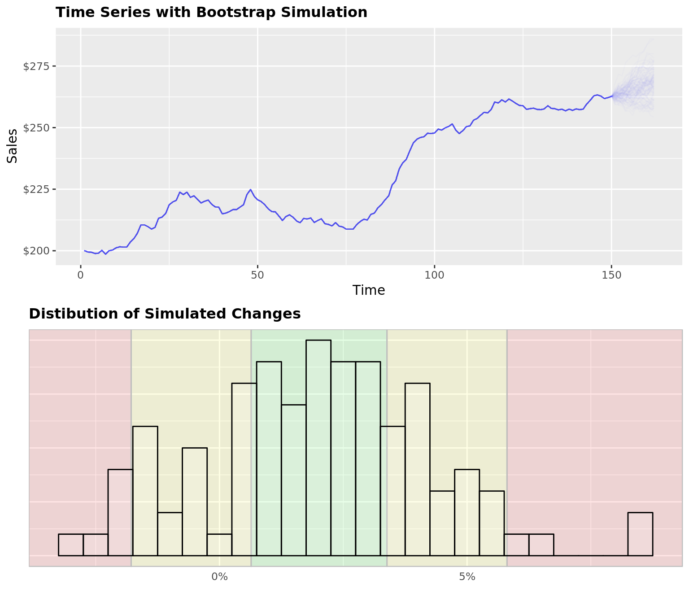
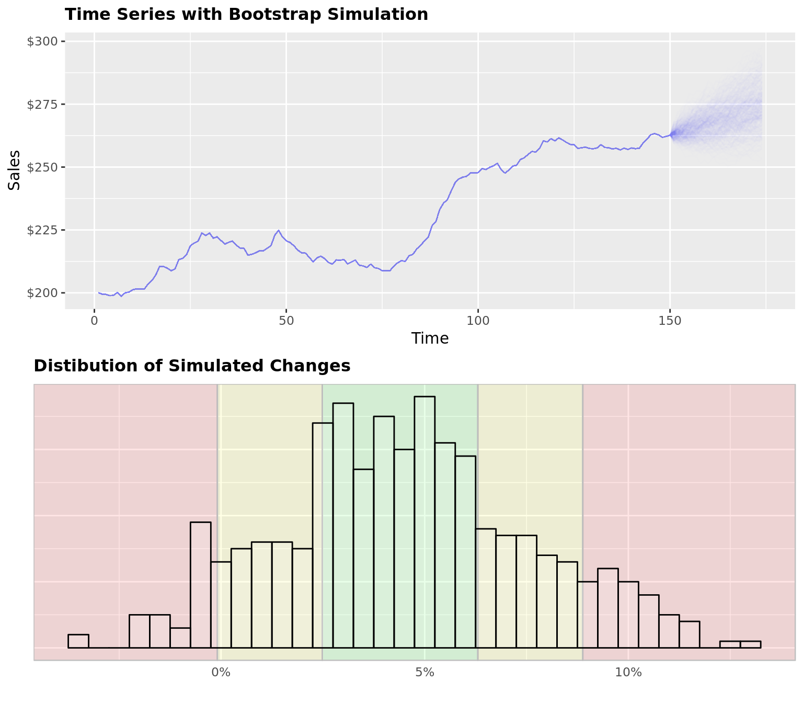

# Simulation {-}

## Bootstrap Simulation {-}

This script creates a function for running a simple bootstrap simulation from a given input. In this example I am using the data set BJsales from R. Bootstrap simulations work by pulling a series of random samples from the past and stringing them together to produce a possible future outcome.

You can specify how many `months.back` you want the simulation to pull samples from and how many `months.forward` you want the simulation to produce. If you want to use recent history make `months.back` a small number. If you want to project your simulation far out into the future, make `months.forward` a larger number. Specify the number of simulations (`trials`).

The function produces 2 plots. The first plot shows the original data as well as each individual simulated `trial`. The second plot is a distribution of the return or total percent change from the last historical value and the last `months.forward` value for each simulation.

The `alpha` parameter controls how transparent the lines are in the first graph.


```r
library(ggplot2)
library(reshape2)
library(scales)
library(grid)
library(gridExtra)

data("BJsales")

boot.plot = function(dt, trials, months.back = 24, months.forward = 12, alph = .1) {

  ## calculate the change history
  lookup = 1 + (diff(dt) / dt)

  ## run run simulation by picking random percent changes from history
  ## repeat for the number of trials
  sims = data.frame()
  for (i in 1:trials) {

    sims =
      rbind(sims,
            matrix(
              sample(lookup, size = months.forward , replace = TRUE),
              nrow = 1)
      )
  }

  time = seq(151, 151 + months.forward - 1, by = 1)

  colnames(sims) = time

  sims[is.na(sims)] = 1

  last.price = dt[length(dt)]

  # calculate the price change from the last known price
  p.chg = data.frame(sims[, 1] * last.price)

  for (i in 2:months.forward) {p.chg = cbind(p.chg, p.chg[, i - 1] * sims[, i])}
  colnames(p.chg) = time

  # calculate the cumulative percent change
  cuml.new = sims[,] - 1
  cuml = data.frame(cuml.new[, 1])

  for (i in 2:months.forward) {cuml = cbind(cuml, cuml[, i - 1] + cuml.new[, i])}
  colnames(cuml) = time

  cuml.chg = data.frame("Price Change" = cuml[, length(cuml)])

  cuml$trial = 1:nrow(cuml)
  cuml = melt(cuml, id.vars = "trial")

  dt = data.frame(time = 1:length(dt), dt = dt)

  ## create graphics
  plot.price = dcast(dt, . ~ time)
  plot.price2 = cbind(plot.price, p.chg)
  plot.price2$trial = 1:nrow(plot.price2)
  plot.price2 = plot.price2[,-1]
  plot.price2 = melt(plot.price2, id.vars = c("trial"))


  cuml = data.frame("cuml.1qrt" = quantile(cuml.chg$Price.Change)[2],
                    "cuml.3qrt" = quantile(cuml.chg$Price.Change)[4],
                    "iqr.15" = quantile(cuml.chg$Price.Change)[4] -
                      quantile(cuml.chg$Price.Change)[2] * 1.5,
                    "med" = quantile(cuml.chg$Price.Change)[3])


  x1 = ggplot(cuml.chg) +
    geom_rect(aes(xmin = cuml.1qrt, xmax = cuml.3qrt, ymin = -Inf, ymax = Inf), data = cuml,
              fill = "green", color = "gray", alpha = .1) +
    geom_rect(aes(xmin = cuml.1qrt - iqr.15, xmax = cuml.1qrt,  ymin = -Inf, ymax = Inf), data = cuml,
              fill = "yellow", color = "gray", alpha = .1) +
    geom_rect(aes(xmin = cuml.3qrt, xmax = cuml.3qrt + iqr.15,  ymin = -Inf, ymax = Inf), data = cuml,
              fill = "yellow", color = "gray", alpha = .1) +
    geom_rect(aes(xmin = cuml.3qrt + iqr.15, xmax = Inf,  ymin = -Inf, ymax = Inf), data = cuml,
              fill = "red", color = "gray", alpha = .1) +
    geom_rect(aes(xmin = -Inf, xmax = cuml.1qrt - iqr.15,  ymin = -Inf, ymax = Inf), data = cuml,
              fill = "red", color = "gray", alpha = .1) +
    geom_bar(aes(x = Price.Change), stat = "bin", binwidth = .005, fill = "white", color = "black",
             alpha = .15) +
    ggtitle("Distibution of Simulated Changes") +
    scale_x_continuous("", labels = percent, breaks = seq(-.5, .5, .05)) +
    scale_y_continuous("") +
    theme(plot.title = element_text(face = "bold", size = 12),
          axis.text.y = element_text(size = 0),
          axis.ticks = element_blank())

  plot.price2$variable = as.numeric(plot.price2$variable)

  x3 = ggplot(plot.price2, aes(x = variable, y = value, group = trial)) +
    geom_line(color = "blue", alpha = alph, se = FALSE) +
    scale_x_continuous("Time") +
    scale_y_continuous("Sales", labels = dollar) +
    theme(plot.title = element_text(face = "bold", size = 12)) +
    ggtitle("Time Series with Bootstrap Simulation")


  return(grid.arrange(x3, x1, nrow = 2))
}
```


```r
boot.plot(BJsales, trials = 100, months.back = 12, months.forward = 12, alph = .01)
```

```
## Warning: `geom_bar()` no longer has a `binwidth` parameter. Please use
## `geom_histogram()` instead.
```

```
## Warning: Ignoring unknown parameters: se
```



```r
boot.plot(BJsales, trials = 500, months.back = 24, months.forward = 24, alph = .005)
```

```
## Warning: `geom_bar()` no longer has a `binwidth` parameter. Please use
## `geom_histogram()` instead.

## Warning: Ignoring unknown parameters: se
```



```r
boot.plot(BJsales, trials = 1500, months.back = 36, months.forward = 36, alph = .005)
```

```
## Warning: `geom_bar()` no longer has a `binwidth` parameter. Please use
## `geom_histogram()` instead.

## Warning: Ignoring unknown parameters: se
```


```r
boot.plot = function(dt, trials, months.back = 24, months.forward = 12, alph = .1) {

  ## calculate the change history
  lookup = 1 + (diff(dt) / dt)

  ## run run simulation by picking random percent changes from history
  ## repeat for the number of trials
  sims = data.frame()
  for (i in 1:trials) {

    sims =
      rbind(sims,
            matrix(
              sample(lookup, size = months.forward , replace = TRUE),
              nrow = 1)
      )
  }

  time = seq(151, 151 + months.forward - 1, by = 1)

  colnames(sims) = time

  sims[is.na(sims)] = 1

  last.price = dt[length(dt)]

  # calculate the price change from the last known price
  p.chg = data.frame(sims[, 1] * last.price)

  for (i in 2:months.forward) {p.chg = cbind(p.chg, p.chg[, i - 1] * sims[, i])}
  colnames(p.chg) = time

  # calculate the cumulative percent change
  cuml.new = sims[,] - 1
  cuml = data.frame(cuml.new[, 1])

  for (i in 2:months.forward) {cuml = cbind(cuml, cuml[, i - 1] + cuml.new[, i])}
  colnames(cuml) = time

  cuml.chg = data.frame("Price Change" = cuml[, length(cuml)])

  cuml$trial = 1:nrow(cuml)
  cuml = melt(cuml, id.vars = "trial")

  dt = data.frame(time = 1:length(dt), dt = dt)

  ## create graphics
  plot.price = dcast(dt, . ~ time)
  plot.price2 = cbind(plot.price, p.chg)
  plot.price2$trial = 1:nrow(plot.price2)
  plot.price2 = plot.price2[,-1]
  plot.price2 = melt(plot.price2, id.vars = c("trial"))


  cuml = data.frame("cuml.1qrt" = quantile(cuml.chg$Price.Change)[2],
                    "cuml.3qrt" = quantile(cuml.chg$Price.Change)[4],
                    "iqr.15" = quantile(cuml.chg$Price.Change)[4] -
                      quantile(cuml.chg$Price.Change)[2] * 1.5,
                    "med" = quantile(cuml.chg$Price.Change)[3])


  x1 = ggplot(cuml.chg) +
    geom_rect(aes(xmin = cuml.1qrt, xmax = cuml.3qrt, ymin = -Inf, ymax = Inf), data = cuml,
              fill = "green", color = "gray", alpha = .1) +
    geom_rect(aes(xmin = cuml.1qrt - iqr.15, xmax = cuml.1qrt,  ymin = -Inf, ymax = Inf), data = cuml,
              fill = "yellow", color = "gray", alpha = .1) +
    geom_rect(aes(xmin = cuml.3qrt, xmax = cuml.3qrt + iqr.15,  ymin = -Inf, ymax = Inf), data = cuml,
              fill = "yellow", color = "gray", alpha = .1) +
    geom_rect(aes(xmin = cuml.3qrt + iqr.15, xmax = Inf,  ymin = -Inf, ymax = Inf), data = cuml,
              fill = "red", color = "gray", alpha = .1) +
    geom_rect(aes(xmin = -Inf, xmax = cuml.1qrt - iqr.15,  ymin = -Inf, ymax = Inf), data = cuml,
              fill = "red", color = "gray", alpha = .1) +
    geom_bar(aes(x = Price.Change), stat = "bin", binwidth = .005, fill = "white", color = "black",
             alpha = .15) +
    ggtitle("Distibution of Simulated Changes") +
    scale_x_continuous("", labels = percent, breaks = seq(-.5, .5, .05)) +
    scale_y_continuous("") +
    theme(plot.title = element_text(face = "bold", size = 12),
          axis.text.y = element_text(size = 0),
          axis.ticks = element_blank())

  plot.price2$variable = as.numeric(plot.price2$variable)

  x3 = ggplot(plot.price2, aes(x = variable, y = value, group = trial)) +
    geom_line(color = "blue", alpha = alph, se = FALSE) +
    scale_x_continuous("Time") +
    scale_y_continuous("Sales", labels = dollar) +
    theme(plot.title = element_text(face = "bold", size = 12)) +
    ggtitle("Time Series with Bootstrap Simulation")


  return(grid.arrange(x3, x1, nrow = 2))
}
```
