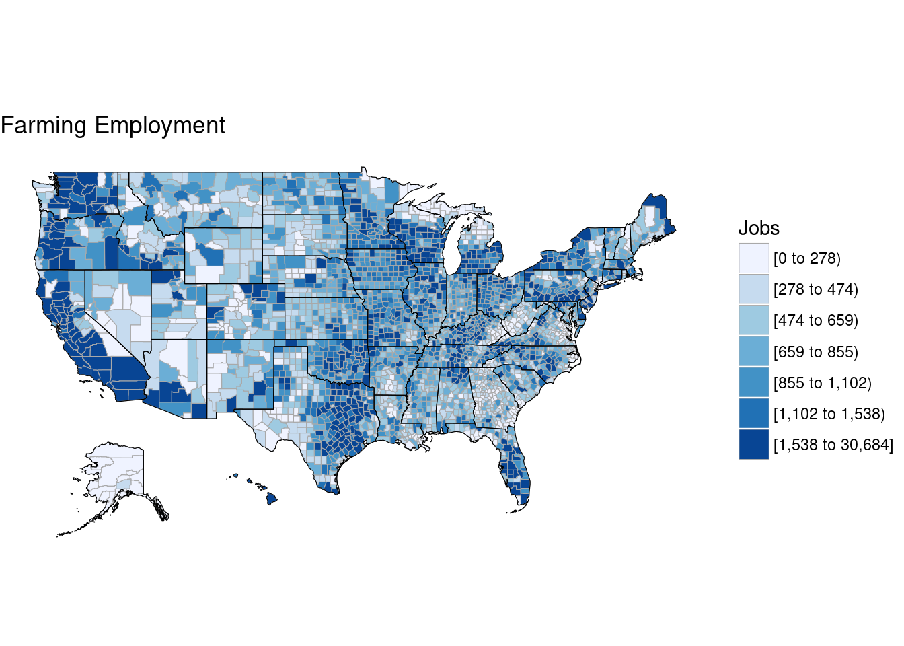
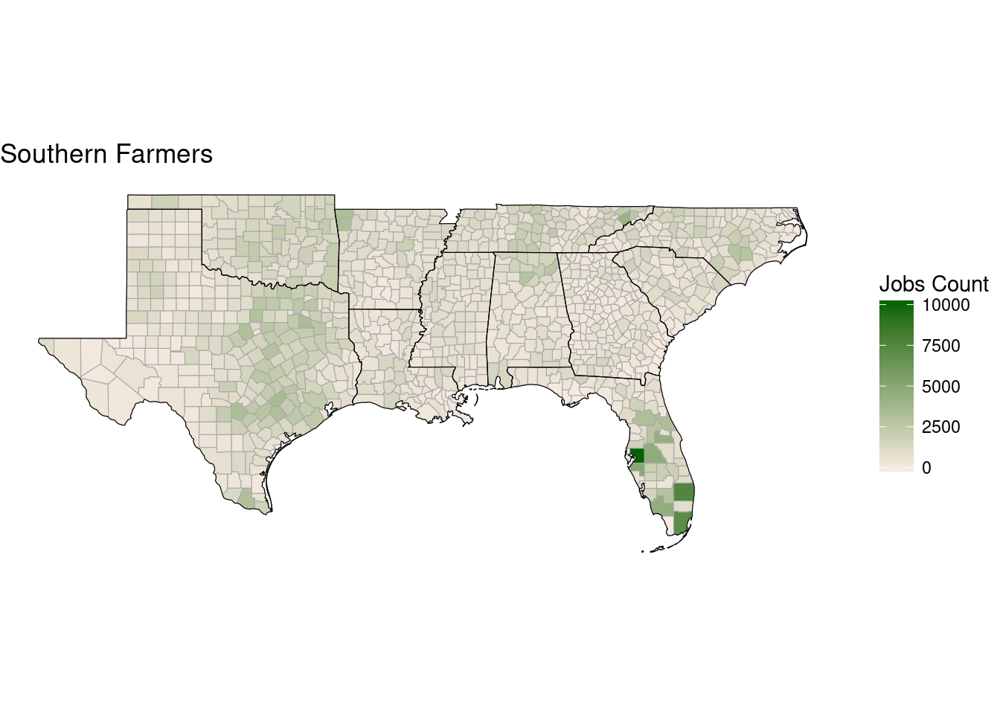
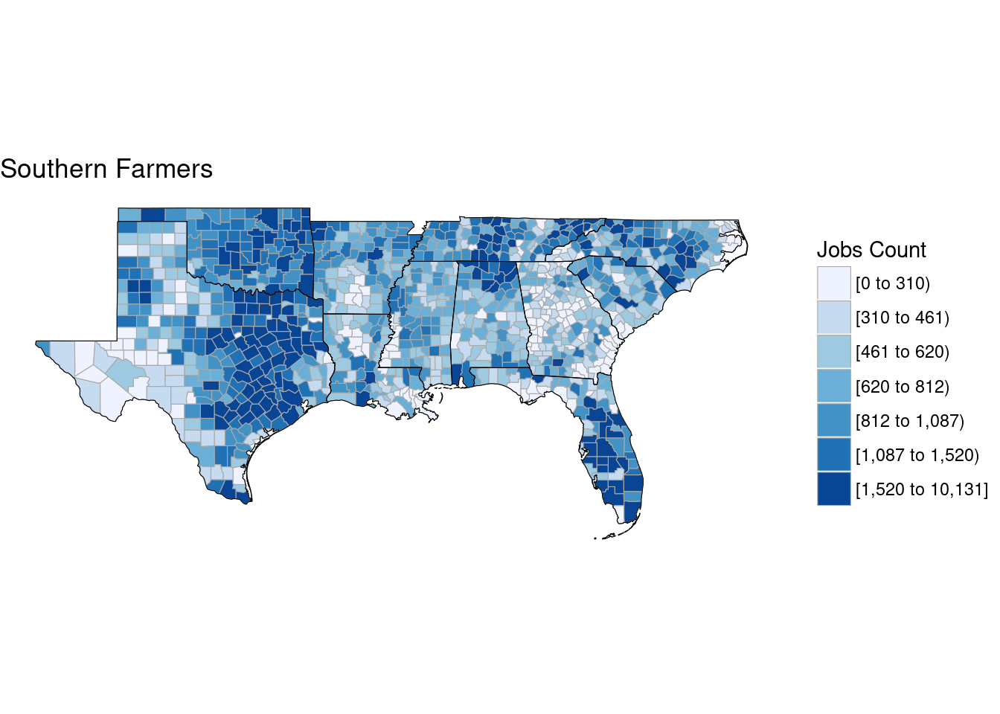
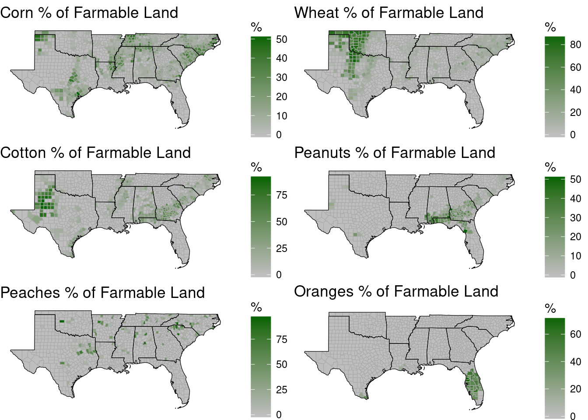

# Visualization {-}

## Building Maps with choropleth and ggplot {-}

Data: Census 2000, number of jobs by industry by county


```r
library(choroplethr)
library(choroplethrMaps)
library(ggplot2)
library(gridExtra)

employment = read.csv("data/census_2000_employment.csv")
crops = read.csv("data/econ_census_2012_farming.csv")

head(employment)
```

```
       Areaname STCOU Farming Mining Construction Manufacturing Trans_Pub_Util Wholesale   Retail
1 UNITED STATES     0 3113000 784200      9446300      19114800        8244400   7584100 27222300
2       ALABAMA  1000   56061   9933       156673        370962         116071    105963   406340
3   Autauga, AL  1001     463      0         1542          2207            493         0     3892
4   Baldwin, AL  1003    1403    198         5943          6156           2449      2148    16184
5   Barbour, AL  1005     579     91          457          5344            764       292     2068
6      Bibb, AL  1007     208      0          842          1033            310       101      793
   Finance
1 13193800
2   147909
3     1017
4     6779
5      570
6      245
```

```r
farming = data.frame(
  region = employment$STCOU,
  value = employment$Farming
  )

county_choropleth(farming, title = "Farming Employment", legend = "Jobs")
```



```r
choro = CountyChoropleth$new(farming)
choro$title = "Southern Farmers"
choro$set_num_colors(1)
choro$ggplot_scale = scale_fill_gradientn("Jobs Count", colors = c("#F6EAE1", "darkgreen"))
choro$set_zoom(c("texas", "louisiana", "mississippi", "alabama", "georgia", "arkansas",
                 "tennessee", "south carolina", "florida", "oklahoma", "north carolina"))
choro$render()
```



```r
## Also without the gradient
choro = CountyChoropleth$new(farming)
choro$title = "Southern Farmers"
choro$legend = "Jobs Count"
choro$set_zoom(c("texas", "louisiana", "mississippi", "alabama", "georgia", "arkansas",
                 "tennessee", "south carolina", "florida", "oklahoma", "north carolina"))
choro$render()
```



```r
## fill in NA with 0 to prevent NULL counties from standing out
crops[is.na(crops)] = 0

## create the individual data sets
corn = data.frame(region = crops$FIPS, value = crops$Corn)
wheat = data.frame(region = crops$FIPS, value = crops$Wheat)
cotton = data.frame(region = crops$FIPS, value = crops$Cotton)
peanuts = data.frame(region = crops$FIPS, value = crops$Peanuts)
peaches = data.frame(region = crops$FIPS, value = crops$Peaches)
oranges = data.frame(region = crops$FIPS, value = crops$Oranges)

## list of states we want on the map
states =  c("texas", "louisiana", "mississippi", "alabama", "georgia", "arkansas",
            "tennessee", "south carolina", "florida", "oklahoma", "north carolina")

## create each graph object
g1 = CountyChoropleth$new(corn); g1$title = "Corn % of Farmable Land"
g1$set_num_colors(1); g1$set_zoom(states)
g1$ggplot_scale = scale_fill_gradientn("%", colors = c("gray", "darkgreen"))

g2 = CountyChoropleth$new(wheat); g2$title = "Wheat % of Farmable Land"
g2$set_num_colors(1); g2$set_zoom(states)
g2$ggplot_scale = scale_fill_gradientn("%", colors = c("gray", "darkgreen"))

g3 = CountyChoropleth$new(cotton); g3$title = "Cotton % of Farmable Land"
g3$set_num_colors(1); g3$set_zoom(states)
g3$ggplot_scale = scale_fill_gradientn("%", colors = c("gray", "darkgreen"))

g4 = CountyChoropleth$new(peanuts); g4$title = "Peanuts % of Farmable Land"
g4$set_num_colors(1); g4$set_zoom(states)
g4$ggplot_scale = scale_fill_gradientn("%", colors = c("gray", "darkgreen"))

g5 = CountyChoropleth$new(peaches); g5$title = "Peaches % of Farmable Land"
g5$set_num_colors(1); g5$set_zoom(states)
g5$ggplot_scale = scale_fill_gradientn("%", colors = c("gray", "darkgreen"))

g6 = CountyChoropleth$new(oranges); g6$title = "Oranges % of Farmable Land"
g6$set_num_colors(1); g6$set_zoom(states)
g6$ggplot_scale = scale_fill_gradientn("%", colors = c("gray", "darkgreen"))

## render each object in order to call as a group
g1 = g1$render(); g2 = g2$render(); g3 = g3$render()
g4 = g4$render(); g5 = g5$render(); g6 = g6$render()

grid.arrange(g1, g2, g3, g4, g5, g6, nrow = 3, ncol = 2)
```


